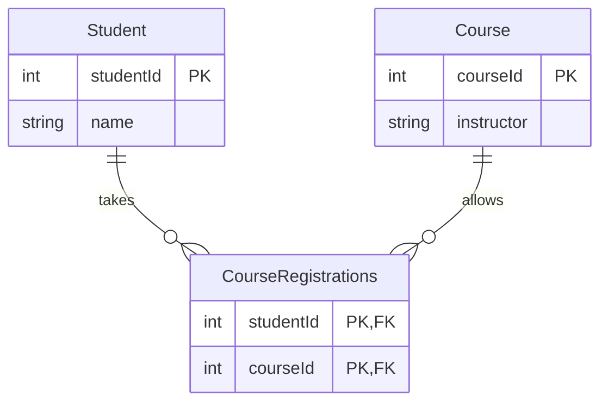
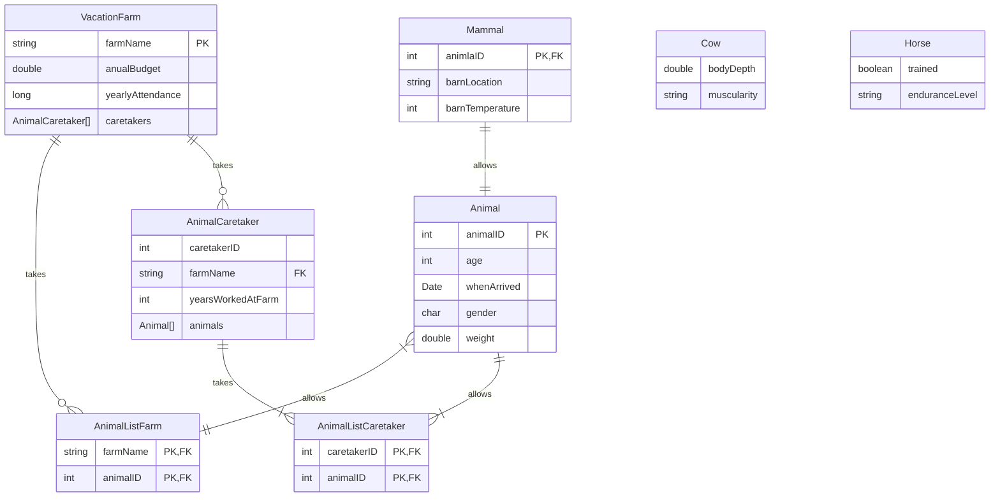

### 6.4 Plan class to Database Schema Convention
Most programs need a database so we need to look at converting our class diagram to a database design
E-R Model called the E-R diagram (ERD)
#### Database Terminology
A *database* comprises a number of tables to store data
A *table* comprises an arrangement of data in columns and rows
The columns of data are called fields. Each field holds data for a specific type of information
- A table may have one or more fields

The rows of data are called records
- Records are similar to rows in an Excel spreadsheet
- A table may have one or more records.
- Ex. 

A *Primary Key* is the field in a table that uniquely identifies each row in that table
- Must be unique for the table
- Only maps to *Exactly* one row in a table
- Ex. you can use a student number to uniquely identify students (No two students have the same number)
- Lots of times there won't be a unique field - in this case, create a new unique identifying number
- In some cases, more than one field combines to create a primary key (*Composite Key*)

A *Foreign Key* is a field used in one table that uniquely identifies a row in another table
- Not all tables have a foreign key

*Database Normalization* is when you design your database structure so that you don't have redundant data in your tables
- Basically, connect a bunch of tables together with foreign keys
- Associations between classes are similar to relationships in database tables
- Also, don't have a bunch of tables with one row

#### Entity Relationship Diagrams
##### Entity
A person, place or thing about which multiple instances of data must be stored
Represented as a table in the database
Will have a name (Name of the table)
Attributes associated with the entity
- Represented as fields in the database

This table has a foreign key that is also the primary key
- 
#### Relationships
ring - *0*
dash - *1*
crow's foot - *More than 1*
#### Cardinality
##### Ring and dash
zero or one

##### Dash and dash
exactly one

##### Ring and crow's foot
Zero or more

##### Dash and crows foot
one or more

##### Example

### 6.5 Develop ER model from a Class diagram
The class diagram should be evaluated for classes that require *permanent* storage
Generally one database table is created for each class that requires storage (Not always)
if a class should be a table in the database most attributes will become fields in the table
#### When inheritance is involved, there are 3 approaches to storing the data in a database
In this, I will reference `Person`, `Student`, and `Instructor`. `Person` is the parent class of both `Student` and `Parent`.

1. Create on DB table per class - this means to get the name of a `Student` of `Person`, you have to reference `Person` instead of the `Student`
	- Impacts performance, must perform multiple lookups to get data
	- Most flexible because there is not replicate data
	- Can use the same primary key for all 3 tables

2. Create one table for each child class (`Student` and `Instructor`)
	- The parent's attributes are repeated for both child tables
	- Has performance gains since we only have one database lookup
	- Maintenance will increase
	- You need different Primary keys for each class

3. Create a single table for all classes in the hierarchy
	- Will include attributes for `Person`, `Student`, and `Instructor`
	- Some attributes will *always* be blank
	- Easy maintenance, high performance because one lookup for everything
	- wasting space
#### Converting classes that use Composition and Aggregation
Classes that use Composition or Aggregation can each be directly into their own table
- Tables will be linked with a foreign key
#### Converting classes that have a many-to-many relationship
In some classes we have a many-to-many relationship that must be represented in the database
- Ex. 
- A student can take many classes and a Course can have many students
- Can't effectively store multiple values in one field of a DB table
- To solve this, we create an additional table (*flattening/joining table*) that maps students to courses
- Ex. 

##### ER Diagram

A student will have one record in the `CourseRegistration` table for each course they are taking
Similarly, we can find all the students in a particular course by searching the `CourseRegistrations` table
If the `CourseRegistrations` table is searched by `StudentId` all rows returned will represent courses that the student is registered in
a search off all rows containing the `CourseId` will result in a list of students in that course
`CourseId` or `StudentId` can be used to look up remaining information the appropriate table
#### Cardinality
specifies how many instances of an entity relate to one instance of another entity
Ordinality specifies the relationship as mandatory or optional
- Cardinality - max number of relationships
- Ordinality - Min number of relationships
### Exercise
#### Class Diagram

#### Solution
Didn't get this finished, don't know how to model the inheritance correctly.

