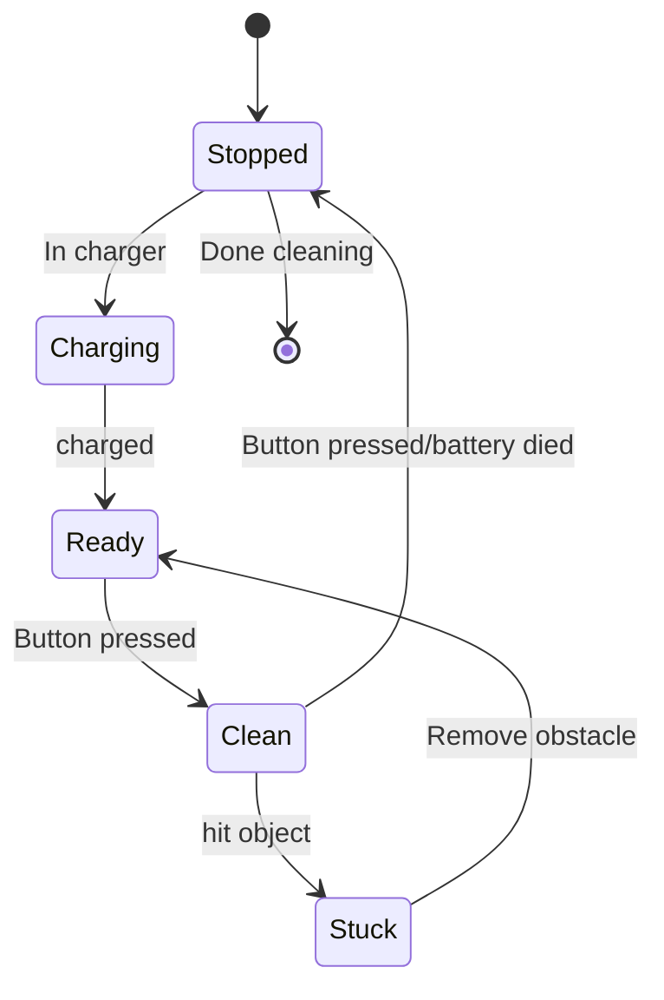

### 6.7 State transition diagrams
Used for
- Modeling object states of a system/object
- Modeling reactive system (Consists of reactive objects)
- Identifying events responsible for state changes
- Forward/reverse engineering
#### Initial State
starting state
Solid black circle
#### Final State
final state
Circle with hollow border
#### State
Condition of an object at a moment in time (time between events)
Indicated by a rectangle with rounded corners
#### Event
A significant occurrence that triggers moving from one state to another state
Indicated by an arrow between states. The event is indicated by text associated with the arrow
#### Practice

