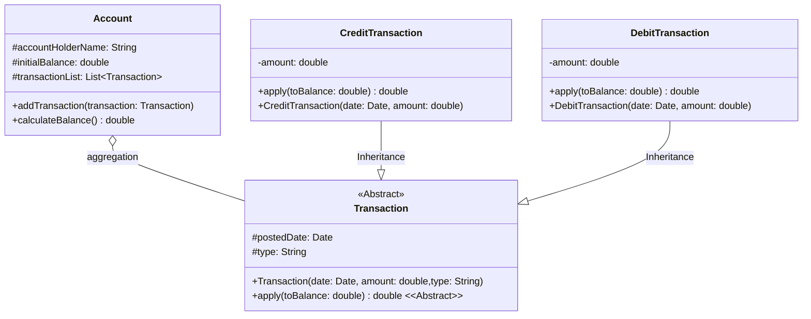
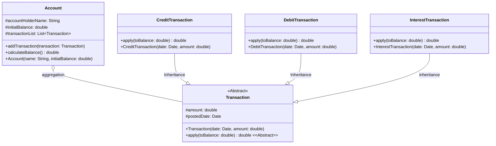

### Mermaid Diagram

```mermaid
classDiagram

class Account {

    #accountHolderName: String

    #initialBalance: double

    #transactionList: List~Transaction~

    +addTransaction(transaction: Transaction)

    +calculateBalance() double

  

}

class Transaction {

    #postedDate: Date

    #type: String

    +Transaction(date: Date, amount: double,type: String)

    +apply(toBalance: double) double ~~Abstract~~

}

class DebitTransaction {

    -amount: double

    +apply(toBalance: double) double

    +DebitTransaction(date: Date, amount: double)

}

class CreditTransaction {

    -amount: double

    +apply(toBalance: double) double

    +CreditTransaction(date: Date, amount: double)

}

<<Abstract>> Transaction

Account o--Transaction: aggregation

CreditTransaction --|> Transaction : Inheritance

DebitTransaction --|> Transaction : Inheritance
```
### With `InterestTransaction`

```mermaid
classDiagram

class Account {

    #accountHolderName: String

    #initialBalance: double

    #transactionList: List~Transaction~

    +addTransaction(transaction: Transaction)

    +calculateBalance() double

    +Account(name: String, initialBalance: double)

  

}

class Transaction {

    #amount: double

    #postedDate: Date

    +Transaction(date: Date, amount: double)

    +apply(toBalance: double) double ~~Abstract~~

}

class DebitTransaction {

    +apply(toBalance: double) double

    +DebitTransaction(date: Date, amount: double)

}

class CreditTransaction {

    +apply(toBalance: double) double

    +CreditTransaction(date: Date, amount: double)

}

class InterestTransaction {

    +apply(toBalance: double) double

    +InterestTransaction(date: Date, amount: double)

}

<<Abstract>> Transaction

Account o--Transaction: aggregation

CreditTransaction --|> Transaction : Inheritance

DebitTransaction --|> Transaction : Inheritance

InterestTransaction --|> Transaction : inheritance
```
