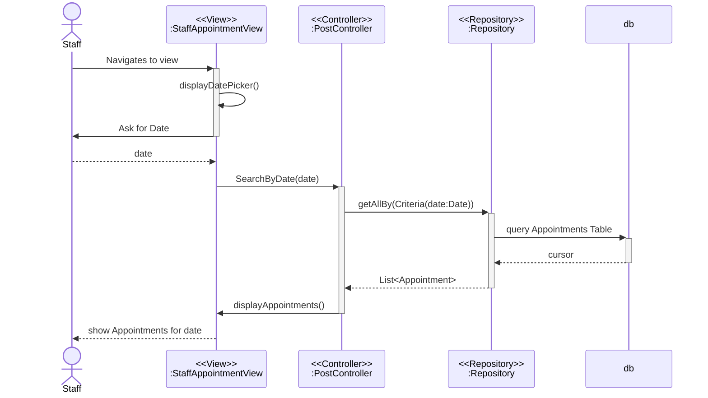

### MVC Sequence Diagram from assignment 2

```mermaid
sequenceDiagram

actor s as Staff

participant v as <<View>><br>:StaffAppointmentView

participant c as <<Controller>><br>:PostController

participant r as <<Repository>><br>:Repository

  

s->>+v: Navigates to view

v->>v: displayDatePicker()

v->>-s: Ask for Date

s-->>v: date

v->>+c: SearchByDate(date)

c->>+r: getAllBy(Criteria(date:Date))

r->>+db: query Appointments Table

db-->>-r: cursor

r-->>-c: List<Appointment>

c->>-v: displayAppointments()

v-->>s: show Appointments for date
```
*solid return lines mean method calls, dotted means return values*
