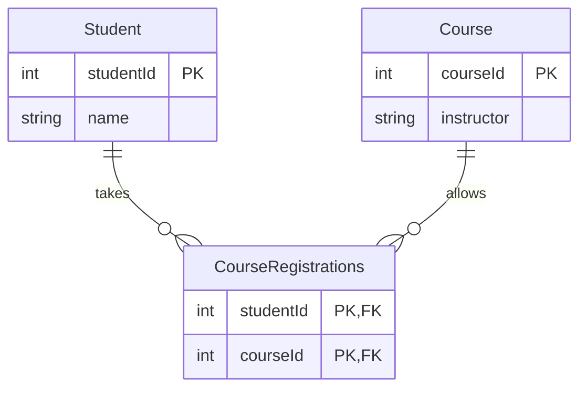
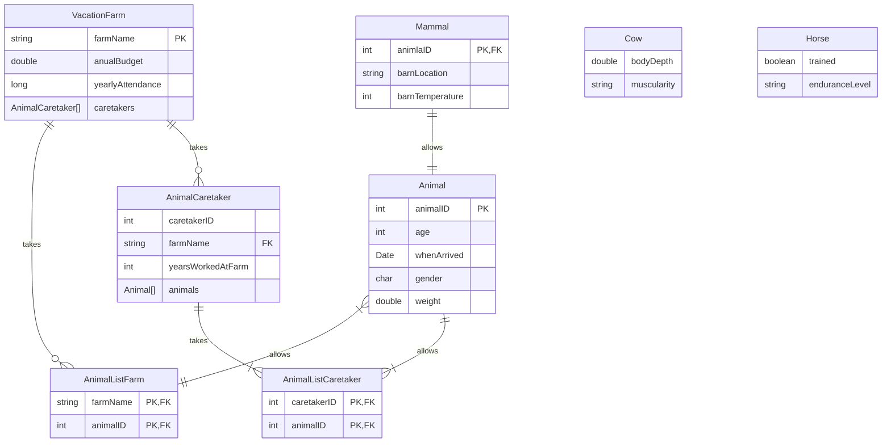
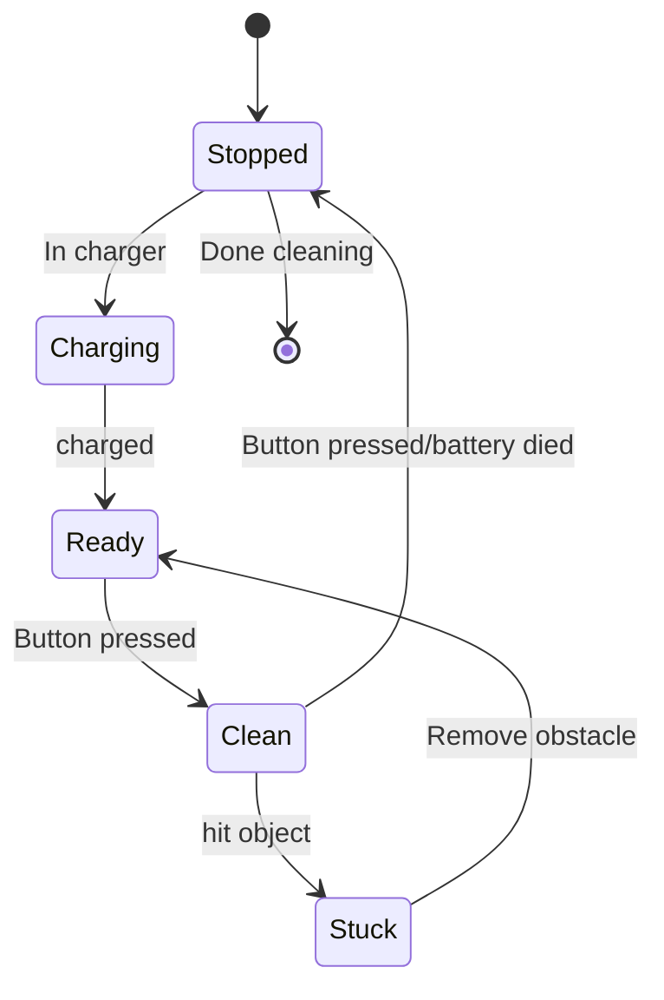
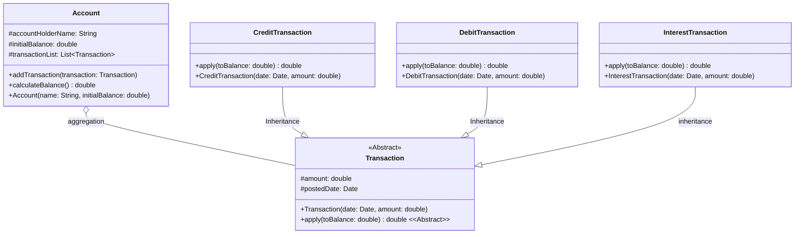

# Coralee's txt file
#### Question 1
1. Select the option below that is NOT a type of software.
a. Program
b. Programming product
c. Programming System
*d. Programming Project*
#### Question 2
2. What is the name of a document that details how the project will be accomplished.
*a. Project Plan*
b. Project Charter
c. Project proposal
d. Project Implementation
#### Question 3
3. What is typically the longest and most expensive stage of software life cycle?
a. Implementation
b. Analysis
*c. Maintenance*
d. Design
#### Question 4
4. Which is an example of a cold communication method?
a. Phone call
b. Email
c. Face to face conversation
*d. Video tape*
#### Question 5
5. Which of the following is not a type of relationship between Use Cases?
a. Include
*b. Associated*
c. Extend
d. Generalization
#### Question 6
6. Which of the following are the components of a User Story?
a. The Card, the Description, the Requirements
b. The Title, the Description, and the Estimate
*c. The Card, the Conversation, and the Confirmation*
d. The Requirement, the Conversation, and the Confirmation
#### Question 7
7. Which of the following should you include in a Use Case Scenario?
a. Multiple failure conditions
b. A generic actor/system name
*c. A numbered list of steps*
d. Branching paths
#### Question 8
8. Sequence diagram are probably the most useful diagrams for day-to-day development because of their being closer to the _ and _ of the system.
*a. Implementation, logic*
b. Logic, usefulness
c. Actors, objects
d. None of the above
#### Question 9
9. A life line indicates the existence of an __ or __
a. Class, method
b. Class, objects
*c. Object, actor*
d. Actor, class
#### Question 10
10. Which is not a component of usability?
a. Learnability
b. Efficiency
c. Errors
*d. Durability*
#### Question 11
11. Which of the following Arrowhead types are used to send Synchronous messages in a Sequence Diagram?
a. Dashed/Dotted Arrowhead
*b. Solid Arrowhead*
c. Open Arrowhead
d. None of the above
#### Question 12
12. What are the 3 categories of design patterns?
*a. Creational, Behavioral, Structural*
b. Creational, Rational, Organized
c. Flexible, Structural, Recognizable
d. None of the above
#### Question 13
13. This principle encourages the separation of the program into distinct sections or components, each dealing with a specific set of information:
a. Open Closed Principle
b. Liskov Substitution Principle.
*c. Separation of Concerns.*
d. Talk, don’t ask.
#### Question 14
14. Well written unit tests will generally lead to more modular software; software components that are easy to write tests for are generally easier to modify. Which are properties of a good unit test?
a. Isolated 
b. Specific 
c. Small 
d. Descriptive
*e. All the Above*
#### Question 15
15. What is an Iterator?
*a. A very common action in any software system is to have to inspect and interact with each of the items in some sort of collection, such as an array, Stack or Queue.*
b. A design pattern which helps developers create more modular code when they are tasked with fetching data from some remote data store, such as a web API, database, or file structure.
c. A set of class designs and interactions used to solve common problems encountered in software development.
d. Any other class which a class makes use of by name, either directly or indirectly.
#### Question 16
16. Testing coverage is a term that indicates the amount of code that has been tested. Which of these are coverage criteria?
a. Function Coverage
b. Statement Coverage
c. Condition Coverage
d. Path Coverage
*e. All the Above*
#### Question 17
17. What is the first step to provide good user training 
a. Assess user needs
*b. Set training goals*
c. Create a training program
d. Both a & c
#### Question 18
Type: E
Points: 1
18. What are the three software models we have discussed in class?
a. Waterfall, Iterative, Agile
#### Question 19
Type: E
Points: 2
19. What are the four statements of the Agile Manifesto? 
a. Individual and interactions over processes and tools. 
Working software over comprehensive documentation. 
Customer collaboration over contract negotiation. 
Responding to change over following a plan
#### Question 20
Type: E
Points: 1
20. List and briefly describe the eight stages of a software life cycle.
a. Project *Initiation* (WHY/WHO/WHERE) - Involves any activities that are required to initiate the project. Includes finalizing details, establishing the required functionality, finalizing prices and agreement on price.
*Analysis* (WHAT) - Project scope is analyzed to determine detailed requirements of the system. Accomplished by questioning clients, questioning employees who will be using system and study documentation currently in use
*Design* (HOW) - Detailed plan of how to develop the software is determined. Must meet all functional and data requirements. NO CODE IS CREATED HERE
*Implementation* (DO) - Development team takes detailed plan from design phase and creates code based on the plans. ACTUAL WRITING OF CODE 
*Testing* - Verification of the software that was written. Often done at the same time as the implementation stage. Ensures that the software was written to the functionality it was intended and to ensure no errors 
*Installation* - Installation of software at client site. Creation of user and installation manuals.
*Maintenance* - Providing support for system after installation. Changes are made to software to allow additional functionality or fix error that exist on system. Lasts the longest of any stage and most expensive 
*Retirement* - Occurs when system is no longer to be used. Development team shuts down system and decommissions it. Removal of sensitive data.
#### Question 21
Type: E
Points: 1
21. What is a Standup meeting?
a. In a standup meeting, sometimes called a “scrum meeting” or daily huddle, teams discuss; What each individual team member did the day before, what each member will do today, and what impediments if any did/does the team member face. 
#### Question 22
Type: E
Points: 1
22. What is the defined process?
a. The defined process is a process in which a task has a predefined order of events that will produce the same results each time. Such as an assembly line or baking a cake. It does not require any background knowledge in the area of the activity being performed.
#### Question 23
Type: E
Points: 2
23. Describe the difference between a Project and an Operation. (List 3 or more)
a. Projects are temporary, Operations are repeating
Projects are goal orientated, while Operations are meant to sustain and maintain the business
Projects are often Unique ( to the company at least) while Operations follow existing procedures and produce the same result every time.
Projects provide an outcome, like a document ( or instructions for an Operation). Operations have no End Data.
#### Question 24
Type: E
Points: 2
24. What is the role of a Scrum Master?
a. The Scrum master is meant to assist the group with any questions they may have about how the agile process works, while also facilitating the group and removing any issues or blockers the group comes across. Their job is to make everyone else more efficient.
#### Question 25
Type: E
Points: 2
25. What are the 7 characteristics of a good requirement?
a. Feasible, Correct, Necessary, Unambiguous/Concise/Explicit, Verifiable, Complete, Consistent
#### Question 26
Type: E
Points: 2
26. What is an Actor?
a. Some entity which performs an activity using the system being created or interacts in some way.
#### Question 27
Type: E
Points: 2
27. What are the 3 main areas of risk mitigation?
a. Identification, Quantification, Mitigation
#### Question 28
Type: E
Points: 1
28. What is the biggest risk to a software project?
a. Building the wrong software
#### Question 29
Type: E
Points: 1
29. What is mitigation? 
a. The action of lessening in severity or intensity 
#### Question 30
Type: E
Points: 3
30. According to Scott W. Ambler, what are the three essential parts of the project initiation to understand client's needs.
a. Usage Model: Explore how users will work with the system and their needs/wants from the system. 
Domain Model: Capture the highest level business level entity who is involved with the project as a whole and their relationship between them. This captures business processes and procedures.
User Interface Model: allows client to have an initial vision of the project, create ideas for the workflow, and how will the project appear when finished.
#### Question 31
Type: E
Points: 2
31. In mitigating and planning risks for a project, describe Risk Mitigation Plan.
a. Indicates how a specific risk will be dealt with, the procedures on dealing the risk, and gives team members a strategy on mitigation that issue so they can lessen the impact of that risk.
#### Question 32
Type: E
Points: 2
32. How can you minimize the size and the scope of project assumptions?
a. To minimize the size and scope of assumptions being made, we build quick prototypes to test out an idea, research online for finding the solutions we need, and talk to other team members for sharing ideas. 
#### Question 33
Type: E
Points: 2
33. What are the two types of actors that may be part of a use case?
a. Primary Actors that are trying to perform the functionality and Secondary Actors that the system uses to perform the functionality.
#### Question 34
Type: E
Points: 1
34. What component of a User Story describes the story's requirements expressed using active language?
a. The Title
#### Question 35
Type: E
Points: 3
35. Describe the three relationships that can occur between ‘Use Cases.’ Give a brief description of the corresponding arrows appearance, what the functionality of the relationship is. You can give an example or a sketch to describe to attach to the explanation.
a. Include: Relationship where one use case includes the functionality of anther use case as part of itself. Indicated by a dashed line, with an open-ended arrow pointing at the ‘part’ which is included, additionally having `<<include>>` positioned on the line.
Extend: Relationship where one use case that uses the functionality and characteristics of another use case and adds on to it is some way. Indicated by a dashed line, with an open-ended arrow pointing at the ‘part’ which is included, additionally having `<<extend>>` positioned on the line.
Generalization: An association exists between use cases when one use case is a specialized version of another use case, a parent child relationship without affecting business flow. Indicated by a solid line with a hollow boxed arrow pointing from the child use case to the parent.
#### Question 36
Type: E
Points: 2
36. When designing Acceptance Test Procedures what should each acceptance test procedure identify?
a. Setup: What pre-conditions must exist, be specific and include detail.
Actions: What steps must be performed. Detail each activity which is part of the test procedure.
Inspect and validate: Expected outcome. How to check the effects or outcome. What is a ‘pass’.
Pass: an indication of success, simply passes this time and still needs to be ran again.
#### Question 37
Type: E
Points: 3
37. List and describe the 5 components of usability
a. *Learnability*: Is it easy for users to accomplish basic tasks the first time?
*Efficiency*: Once users have learned the design, how quickly can users perform tasks?
*Memorability*: how easily can users reestablish proficiency after not using the software over a period of time?
*Errors*: How many errors do users make and how easily can they recover from the errors? Are the errors severe?
*Satisfaction*: How pleasant is it to use the software?
#### Question 38
Type: E
Points: 2
38. What are the two types of GUI mockups?
a. Low- fidelity prototypes-unable to interact
High-fidelity prototypes- allow interactions
#### Question 39
Type: E
Points: 3
39. What makes a good design? List 3 out of the 7 guidelines.
a. Focus on users and the tasks the users perform: Design GUIs in such a way that users performing jobs/ tasks can do so in a easy and efficient manner
Consider functionality before presenting: Basic functionality is more important compared to a fancy GUI that users view. Without functionality the GUI is useless
Design from user’s point of view: Use low level technical language that the user would engage with easily. If a process must have difficult steps provide helpful instructions
Design to make results easy to archive: Consider how many times a particular function is performed and by how many users. Create those functionalities so they require the least amount of user interaction to be performed
Be clear and consistent: Build GUIs so all windows/ screens are similar for the user to avoid confusion and potential errors
Presentation is important once functionality is established. Consider: Visual ordering, Scannability of the page, Match mediums within the GUI
Design for responsiveness: Think about what a user would value most when comparing system speed to perceived speeds of performing a task
#### Question 40
Type: E
Points: 3
40. How do you make an interface easy to read and navigate?
a. Make sure that the most frequently accessed information is easily accessed. You can do this by grouping elements on the page together that are important or by aligning your content properly by maintaining a top-to-bottom, Left-to-right flow.
#### Question 41
Type: E
Points: 2
41. What are the four types of relationships between objects in an implementation diagram?
a. Inheritance, Composition, Aggregation, and Uses (Association)
#### Question 42
Type: E
Points: 2
42. What does the S in SOLID Stand for and explain what it means?
a. The “S” Stands for Single responsibility principle. Each class in a system design should have only one responsibility, and the responsibility should be entirely contained by that class.
#### Question 43
Type: E
Points: 2
43. Briefly explain the dependency inversion principle.
a. The dependency inversion principle attempts to decouple the behavior required of a system from how it is actually implemented. It states that:
High-level modules should not depend on low-level modules. Both should depend on abstractions. Abstractions should not depend on details. Details should depend on abstractions.
#### Question 44
Type: E
Points: 3
44. What are the differences between Creational, Behavioural, and Structural design patterns? 
a. Creational Design Patterns describe common ways in which objects or sets of objects can be instantiated and connected together. Behavioural Design Patterns describe solutions to common sets of objects interactions, and Structural Design Patterns help create more simpler and modular inheritance and object relational structures. 
Creational is supposed to be the different ways that objects can be instantiated and connected together, while Behavioural are the solutions between interactions, and Structural create more modular and simpler inheritance and object relational structures. 
#### Question 45
Type: E
Points: 3
45. What are the SOLID principles of object-oriented design? List each principle and a basic meaning of each principle. 
a. *Single Responsibility* Principle: This principle states that each class in a system design should have only one responsibility and only one reason to change. 
*Open Closed* Principle: This principle states that classes and interfaces should be open for extension (inheritance), but closed for modification. 
*Liskov Substitution* Principle: This principle states that any object in the system should be able to be replaced by any of its subclasses without affecting the correctness of the system. 
*Interface Segregation* Principle: This principle is closely related to the single responsibility principle. No client object should be forced to depend on methods that it does not use. 
*Dependency Inversion* Principle: This principle states that high level classes should not depend on low level classes; both should depend on highly abstract classes or interfaces. 
#### Question 46
Type: 2
Points: 3
46. Before writing tests, it is often a good idea to plan out the basic set of conditions under which the unit of functionality should be tested. What three things should you create a set of data points for when planning tests?
a. Preconditions, Input Data, and Post Conditions and Expected Results
#### Question 47
Type: E
Points: 2
47. List and briefly describe 4 properties of a good unit test.
a. *Isolated* – Outcome should not affect other unit tests.
*Specific* – Focus on testing as few methods as possible. Should be testing a single small requirement.
*Small* – Should be at most 10 to 20 lines of code each.
*Descriptive* – Each test should be named so that you should know what is being tested.
*Clear* – Each test should have clear expectations of the method it is running. Developer should know what the outcome will result.
*Fast* – Should be as fast as possible to encouraging running them often.
*Repeatable* – Tests should be able to run reliably again and again.
#### Question48
Type: E
Points: 3
48. You have developed software that takes in two positive integers that represents the sides of a rectangle and calculates the area. If given 0 or less than 0 as one or both parameters, the program should return 0. List and describe the three types of test cases you should test your software with and give an example of each.
a. Normal Case: Values that the system expects and can work with. Normal functioning of the system. Ex. 5 and 10 would equal 50
Exception Case: Values that would give an error when used or not be. Ex. -5 and 5 should return 0. -10 and -7 should also return 0.
Boundary Case: Values right at the edge of a valid case. Ex. 1 and 1 should return 1. 0 and 0 should return 0.
#### Question 49
Type: E
Points: 2
49. What three factors should you keep in mind for the creation of unit tests?
a. preconditions, input data, post conditions/expected output
#### Question 50
Type: E
Points: 1
50. What is regression testing?
a. Rerunning tests that had already passed after new code has been added to ensure that the tests still pass.
#### Question 51
Type: E
Points: 2
51. Explain two differences between Big Bang Testing and Bottom up testing.
a. In Bottom Up Testing, the smallest modules are tested in isolation first, then larger and larger combinations of modules are tested at higher and higher levels. 
 In Big Bang testing, the entire system is intended to be assembled and running in an environment that closely resembles its intended production environment.
#### Question 52
Type: E
Points: 3
52. What 5 topics should be included in a good training program?
a. Purpose of the system. Functions of the system. Changes from previous versions. Common problems. Security issues.
#### Question 53
Type: E
Points: 3
53. What are 3 considerations you must think about when creating an installation plan.
a. Migrating data from existing system to new system.
Rerunning tests with actual data.
Rolling out the new system for a few users.
Providing user training.
Rerunning new system in parallel.
Switching the new system.
Retiring the old system.
# My Notes
## LO6
### GUI
#### Components of Usability
Learnability, Efficient, Memorability, Errors, Satisfaction, Consistency
#### Difference Between High and Low Fidelity Prototypes
##### Low-Fidelity
Often paper based, doesn't allow user interactions
##### High-Fidelity
Computer based, allows realistic user interaction
Wizard of Oz - User isn't controlling the page, when they do something the "Wizard" changes the page
#### Ordering of Screen data and content
Possible ways to order controls
- Conventional (Copy from other examples)
- Sequence
- Frequency of use
- Function
- Importance

*Information that is compared must be visible at all times*
- If you're comparing 2 guns in destiny you want to be able to see both their stats at the same time

*All information on screen should be relevant*
*Tab Order*
##### Gestalt Principles of Visual Perception
*Proximity* - Items near each other appear grouped
*Similarity* - Items that look similar appear grouped
#### Testing GUI Design
*Heuristic Evaluations* - Done by usability expert
*Usability testing* - Done by regular users
### Analysis and Implementation Diagrams
#### Object Oriented Terminology
Each object is responsible for it's own data and functions
view of software data and code is broken down into objects
#### Identifying classes form word choice in Use case diagrams and user scenarios
*nouns* - classes
*verbs* - behaviours/functions included in the system
*Adjectives*/*Adverbs* - attributes of objects
#### Analysis
High level, doesn't include specific behaviours or attributes
*represents classes and relationships between them*
*Attributes* associated with classes are the data for that class
*Behaviours* are functions performed by that class
A class is responsible for implementing all of it's own behaviours
#### Implementation
Still high level, but more in depth than Analysis
*will be reworked and expanded during design to identify all required classes and public methods*
##### Creating an implementation diagram
determine all functions that will be used in the code
- What classes are required
- Responsibilities of each class
- How the classes interact
#### Analysis vs Implementation
*Methods*/*Behaviours* are only included in implementation
*Relationships* are defined in implementation - Can't just use normal lines anymore
Implementation is more comprehensive because it lists all classes
### Associations between objects
#### Inheritance
One class is the *Parent*, one is the *Child*
child inherits all attributes and behaviours of the parent
Child can add it's own attributes and behaviours specific to itself
*Indicated with an open triangle arrow pointing towards parent*
#### Composition
*Like aggregation but can't exist without the other class*
"Strong form of aggregation"
"*Lifeline of the part is bound within the lifeline of the whole*"
Examples given for this are really shitty
- Gaming setup isn't complete unless you have both a PC and monitor

Even if you're missing the "part" the whole thing is fucked
If I'm going down you're going down with me **MOTHER FUCKER**
*Indicated with a whole black diamond pointing towards the whole*
#### Aggregation
Classes made of smaller classes
One class can exist without the other unlike composition
Ex. A car still exists even if the driver isn't inside it
Consist-of, has-a, is-part-of
"Weak form of aggregation"
*Indicated with a hollow diamond that points towards the whole*
#### Uses (Association)
*basically a catch all*
"Used for relationships that aren't Inheritance, Aggregation or Composition"
*Identified with an arrowhead that points from the source to the target object*
### Attributes
Will be stored as data in a class so the data type is indicated in implementation diagram
*+* - Public, accessible by other classes
*#* - Protected, accessible by the class and all child classes
*-* - Private, accessible only by it's own class
### Methods
Implementation diagrams include methods, parameters and return values
### Database stuff
ER Model/ER Diagram (ERD)
#### Terminology
*Table* has an arrangement of data in rows and columns
Rows of data are called *Records*
*Primary Key* is the field in a table that uniquely identifies each row
- Only maps to *one* row in the table
- Can combine multiple fields to create a primary key (*Composite Key*)

*Foreign Key* is a field used in one table that uniquely identifies a row in another table
*Database Normalization* is designing your database to not have redundant data
- Associations between classes are similar to relationships of database tables
- *Basically connect a bunch of tables together with foreign keys*
#### Entity Relationship Diagrams (ER Model/ERD)
*Entity* - person, place or thing which multiple instances of data must be stored
- Represented as a table in the database
- Will have a name (name of the table)
- Attributes associated with the entity are represented as fields in the database
#### Relationships
*ring* - 0
*dash* - 1
*crow's foot* - More than 1
##### Cardinality
*Basically, the first one is the min and the second one is the max*
Can use this to model 1-1, 1-many and many-many relationships

*Zero* or *One*
- Ring and dash

*Exactly One*
- Dash and Dash

*Zero* or *More*
- Ring and Crow's foot

*One* or *More*
- Dash and Crow's foot
#### Making an ER Model from a class Diagram
Class diagram should be evaluated for classes that need *permanent* storage
If a class becomes a table most attributes of the class will become the table's fields
#### There are 3 ways to storing data in a table with Inheritance
**IMPORTANT**, this will be on the final
*In this example, `Person` is the parent class of `Student` and `Instructor`*
##### Create one Table per class
To get the name of a `Student` or `Instructor`, you have to reference `Person`
Impacts performance, *Have to do multiple lookups to get data*
Most flexible because there will be no replicate data
Can use the same primary key for all 3 tables
##### Create a Table for each child class
Parents attributes are repeated for both child tables
Performance gains since you only have to do one lookup
*Increased maintenance*
Need different Primary Keys for each class
##### Create one table for all classes in the hierarchy
Will include the attributes for `Person`, `Student` and `Instructor`
Attributes not being used (Ex. Instructor attributes in a Record of `Student`) are left blank or null.
Easy maintenance, good performance because only one lookup
*Waste of space from unused fields*
May cause issues when trying to do lookups as values are null or blank
#### Converting Classes that have a many-to-many relationship
Sometimes you need to model a many-to-many relationship
- Ex. A student can have many classes and a class can have many students

To link these tables we need another table in the middle (*flattening/joining* table)

Student/Course Example
- A student will have one record in `CourseRegistration` table for each course they are taking
- Can find all students in a course by searching the `CourseRegistration` table by `CourseID`
- Can find all courses a student is taking by searching the `CourseRegistration` table by `StudentID`
### Sequence Diagrams
Implementation diagrams show the classes that make the software, but doesn't show how they work together
#### Definition
UML Diagram used to describe the interactions between objects in the software system
*Clearly shows the sequence of messaging between objects (Method calls and such)*
Helps show the flow of logic between objects in the system
#### Reasons to make a sequence diagram
Increased understanding of system before writing code

Will make the diagram using classes from the class diagram
Models you create will be a part of the design phase and be updated as you make changes
*Should not have any classes/attributes/methods that don't show up in documentation*
- If you are missing them in documentation, add them
#### What to make a sequence diagram from
Usage Scenarios - How the system is used/interacted with
#### Parts of a Sequence Diagram
##### Targets
Parts of the system whose interactions you are modeling (*Actors/Objects*)
Actors represented by *stick figure*, placed on left side of the diagram
Objects represented as a *rectangular box* with normal UML notation for object names
- Don't normally create an object with an instance name unless you are going to reference it later or if you have multiple
##### Lifelines
Indicates the existence of an object/actor
*Dashed line*
##### Activations
Length of time a message is active
Indicated by a *Box on the lifeline*
Can have multiple at the same time/on top of each other
##### Message
communication between instances of sequence diagram
Represented by *lines between object lifelines* or from *an object lifeline to itself* (Self call)
Types of messages are indicated with different arrowheads
- Arrow will always point in the direction of the method call
###### Types of Messages
*Solid Line*
- Message is being passed or method is called
- include names and parameters
- *Solid* arrowhead indicates a *synchronous message*, which means the caller will wait for a reply
- *Open* arrowhead indicates an *asynchronous message*, which means it doesn't wait for a reply

*Dashed/Dotted Line*
- *Return value from message*
- Response value can be indicated on the line
- Not necessary to include the value if it's obvious
###### Tips for messages
Message and return values *can go in either direction*
Messages between objects are composed of the method signature, parameters and possibly parameter values
Messages between actors and objects are *short phrases* (Plain text, not code)
###### "Lost And Found"
Sometimes you want to make multiple diagrams for one system
If you want to indicate your diagram interacting with something not in the diagram by sending/receiving messages or pointing to a single black dot (sending messages to the void)
###### Self Messages
Can model these with a set of stacked activation boxes
#### Frames, Alternatives and Loops
##### Frames
Regions/fragments of the diagram
Used to support conditional (Alternatives/Options) and looping structures

*Guard Expressions* are logical statements (conditions) placed in square brackets \[], and indicate what needs to be true for the message to send
- *Drawn as a box surrounding message as a part of condition or loop*
- Has a title in the top left saying whether it's a condition or loop
- Expressions are placed above applicable messages
- *Basically, `while(condition)` or `if(condition)`*
##### Alternatives
*`if else/else-if`* statement
Used for conditionals with mutually exclusive logic (when you don't need to loop)
Made by labeling a *Frame* as *alt* in mermaid
Place Guard expressions over applicable messages
##### Options
*`if`* statements, no *`else/else if`*
 Made by labeling a *Frame* as *opt* in mermaid
 Place Guard Expressions over applicable messages
##### Loops
Don't have specific syntax, can do *`while(condition)`* or *`for(item in Collection)`*
Made by labeling a *Frame* as *Loop* in mermaid
### State Transition Diagrams
Used for
- Modeling Object states of a system/object
- Modeling reactive system (reactive objects)
- Identifying events responsible for state changes
- Forward/Reverse Engineering
#### Initial State
starting state
Solid black circle
#### Final State
Circle with hollow border
#### State
Condition of an object at one moment in time in time (Time between events)
#### Event
Significant occurrence that triggers moving from one state to another
Indicated by an arrow between states, text associated with the arrow is the name of the event

## LO7
### Best Practices in Object Oriented Programming
End result of the software will likely be much different from initial intention
#### SOLID - **VERY IMPORTANT, WILL BE ON FINAL**
##### Single Responsibility Principle (SRP)
*Each class in a system should only have one responsibility and one reason to change*
If a class contains loosely related functions it lacks cohesion

You can identify if a class violates the SRP is to *ask if it would be easy to re-use in another project*
- Classes that are easy to re-use generally have fewer dependencies on other classes to function

Examples of things you might want to change in the project
- Internationalization (Canadian provinces/US states)
- Changing database servers
- Password storage location change
- Digital copies of labels (PDF) for email
- Connect to printer via IP

*Basically, make things more modular and not dependent on other Objects/parts of your code.*
##### Open/Closed Principle (OCP)
Classes should be open for inheritance but closed for modification (*Make your variables protected*)
##### Liskoy Substitution Principle (LSP)
Any object in the system can be replaced by it's sub classes without changes to the code
##### Interface Segregation Principle (ISP)
No client object should depend on methods it doesn't use
##### Dependency Inversion Principle
High level modules should not depend on low level modules
- Both should depend on abstractions
- Details should depend on abstractions not the other way around

Most object-oriented software consists of high level, more abstract classes which model business logic and the process of the system
- A series of low-level, concrete classes which implement system-specific details
- Essentially, the DIP state *a class should not rely on objects/classes that are more low-level than themselves*

Dependency Inversion tends to reduce overhead by distinguishing *what* a class does rather than *how* it does it
It's common to see noobs combine user interface and functionality aspects within the same class/method
- *Also related to SRP*
#### Separation of Concerns Principle (SoC)
deals with more *high level concepts* instead of individual classes
Similar to SRP, encourages modular code and separating your code in logical parts

Implemented by *defining set interfaces which describe the behavior of a class/set of classes* and having components define those interfaces
*Doesn't cover low-level details* of how the classes are implemented
Hiding methods/information is a good way to make things more modular
Having well defined interfaces will lead to more *maintainable and easy to modify system*

Basically, make your stuff modular with Interfaces to have set ways that things are supposed to be done
##### Three-Tiered Architecture - *What MVC is based on*
Method of application design where the application is split into 3 layers
Each segment only communicates with the direct adjacent segment
###### Presentation Layer (View)
*"stupid" layer*, just displays what it's told to by the Business Logic layer
commonly considered the *"top" tier*
Contains *user interface* and *user interaction*

Responsibilities
- *Presenting information* from business layer
- Receiving and translating *user input*
- Informing the user of operations in lower tiers

Generally if you have multiple versions of an application (Say a mobile and desktop app), they will have different Presentation layers but very similar Data and Business Logic layers
###### Business Logic Layer (Controller)
"Glue" of the application, "middle" tier
Connects the presentation layer and Data layer so they are not directly communicating with each other
*Don't shit where you eat, do data validation*
- 

Responsibilities
- *Processing commands* from presentation layer
- Applying business rules, logic and validation
- *Commands the data to persist or retrieve data* (Queries)
- Communicates with presentation layer to display output
###### Data Layer
*Mostly handled by libraries these days*
Storing and retrieving data
Provides abstract interface to data storage/retrieval so how you access the data is independent of how it's stored
*Objects shouldn't be aware of how other objects work*
Interface between Business Logic and Data layers usually takes the form of *Domain Objects* or classes

Ex. A data tier calendar application might accept/produce lists of "Appointment" Objects instead of SQL Statements (*Less likely for SQL Injection to happen*)
#### Software Design Pattern
Most software design problems can be grouped into a bucket with other similar issues that have been solved
#### Tell, Don't Ask
Write objects to *tell each other what to do instead of asking questions about their state and making decisions/calculations* based on their answers
Related to other principles, *Objects shouldn't know how other objects work*

Related to the concept of *encapsulation* or *information hiding*
- Instead of providing access to internal implementation, provide a set of operations the class can perform but *Hide how the operations are performed*
- Make decisions which affect an object *inside of that object*
- Makes it easier to understand as you don't need to know every detail of what is happening

*Separate methods that display data and change data*

*Also don't want to method chain*, which is where a method reaches deeper into the hierarchy to retrieve or set a value
#### Design Patterns
*Creational* - how objects are initiated/connected together
- Tries to hide details
- *Singleton*

*Behavioral* - Common sets of object interactions, create structure of how objects interact with each other
- Iterator
- *Repository*

*Structural* - Create more simple and modular inheritance and other relational structures
- *Adapter*
##### Singleton
Ensures there is only one instance of an object at a time
- Sometimes used to defer the creation of an object
- Very simple to implement in most languages, make sure you have the "*Only one at a time*" behavior is needed
##### Repository
Create more modular code by fetching from a remote source rather than directly instantiating a database
Basically, instead of looking for each record of a Car in a database, get an *`ArrayList` of Car objects from the database*.
## LO8
### Unit Testing
Type of *White Box Testing* - Tester knows how software is implemented
Each unit test is  small, isolated part of the application
Typically a unit is on one method or at most a class
Goal is to *Separate each part of the application* and *Verify it operates properly*

Tests are often performed by a *test driver* (professional tester)
- Responsible for exercising functionality of the code method by method

Re-running tests after changes are made to ensure functionality still works is called *regression testing*
*JUnit* is an example of a tool used to perform unit tests
#### Good Unit test properties
Should generally lead to more modular software
*Isolated* - Outcome of test should not affect another one. *Success/failure should not depend on another test*
*Specific* - Should focus on as few methods as possible, preferably a single method. *Should only cover one requirement*
*Small* - Fast, easy to read
*Descriptive* - Test name should be ridiculously long
*Clear* - Should have clear expectations of the outcome
*Fast* - Should run as fast as possible to encourage running them more (*Remember Regression testing*)
*Repeatable* - Should be able to run again and again and *result does not change unless there is a bug*
#### Unit Tests vs Integration Tests
Unit tests are for small, simple units of functionality
- Classes it does depend on should be controllable by the unit tests themselves

*Integration Tests* cover a large amount of functionality in the application
- Tests more classes/modules at once
- Should check that the smaller tests work together correctly
##### Table of differences

| Unit Tests                                                                                        | Integration Tests                                                                             |
| ------------------------------------------------------------------------------------------------- | --------------------------------------------------------------------------------------------- |
| *White Box*, tested with full knowledge of code implementation                                    | *Black* or *White box*, sometimes with and sometimes without knowledge of code implementation |
| Uncovers issues with the implementation of a *single module/method*                               | Uncovers issues that may arise when *modules are used together*                               |
| Written in code, using a test driver such as *JUnit*                                              | May be written in code using *UI automation tool*, but more often as a *script of user input* |
| Carried out *while classes/methods are being written*                                             | Carried out *after* a portion of the system or *major feature has been implemented*           |
| Doesn't use very many outside classes, and are *used/controlled by unit test* where they are used | *Combines many classes/modules* together to test their interactions                           |
| *Isolated*, doesn't make use of outside systems such as a database                                | Often makes use of *test-specific storage systems/databases*                                  |
| Fast and automated                                                                                | Might be automated, but usually much *slower due to the amount of setup*                      |
| Large number of tests are written during implementation, *many written for each method/class*     | Only a few are written for each story/feature, high-level implementation                      |
| Smallest test *written during software project*                                                   | Tests code and features for which *unit tests have already been created*                      |
*BLAT* are a form of integration testing as they are often *written from the perspective of the user*
Most *acceptance tests* are coded as a series of *Unit Tests*, *Integration tests* ensure the *feature works in the system*
### Integration Tests
#### Big Bang Testing
Sometimes referred to as *Top-Level testing* or *end-to-end testing*
*Most common* form of integration testing
Entire system is intended to be assembled in an *environment that resembles production*
Generally performed near the *end of software development*
Better for detecting *high-level errors*
#### Bottom-Up Testing
smallest parts of the modules are tested in isolation first
Used for huge projects, not as much small stuff
### Test Planning
Each *functional requirement* must have a complete set of *unit*, *acceptance* and *integration tests*
#### Basic Conditions (PIP)
Before you write a test it's a good idea to define the basic conditions

*Preconditions* - What objects/configurations are needed for the test to be done

*Input Data* - Possible values allowed in the system
- *Normal Case* - Typical functionality of the system
- *Exception Case* - Unexpected behavior (Wrong or not)
- *Boundary Case* - Values on the edge of valid/invalid

*Post Conditions*/*Expected Results* - What the system is supposed to be like after it's done
##### Examples
###### Method 1
`+int calculateRectangleArea(int height, int width)`
- take in width and height of rectangle and return it's area
- Width and height should be positive
- If the parameters are <= 0, 0 should be returned

| Case      | Preconditions | Input Data                | Post Conditions | Expected Result              |
| --------- | ------------- | ------------------------- | --------------- | ---------------------------- |
| Normal    |               | height: 2, width: 10      |                 | returns: 20                  |
| Boundary  |               | height: 0, width: 0       |                 | returns: 0                   |
| Exception |               | height: -5, width: 6      |                 | returns: 0                   |
| Exception |               | height: 6, width: -5      |                 | returns: 0                   |
| Boundary  |               | height: 1, width: 1       |                 | returns: 1                   |
| Exception |               | height: 2, width: INT_MAX |                 | Nonsense, usually don't test |
|           |               |                           |                 |                              |
###### Method 2
`+boolean createNewAccount(int accountID, float beginningBalance, String name)`
- Account IDs in the range of 10k-20k
- Must be a database connection to update balance

| Case      | Preconditions          | Input Data                                       | Post Conditions                                       | Expected Result |
| --------- | ---------------------- | ------------------------------------------------ | ----------------------------------------------------- | --------------- |
| Normal    | Database Connection    | accountID: 15000, balance: 500, name: "fuckhead" | Database still connected, new record in database      | returns true    |
| Boundary  | Database Connection    | accountID: 10000, balance: 500, name: "fuckhead" | Database still connected, new record                  | returns true    |
| Boundary  | Database Connection    | accountID: 20000, balance: 500, name: "fuckhead" | Database still connected, new record                  | returns true    |
| Boundary  | Database Connection    | accountID: 9999, balance: 500, name: "fuckhead"  | Database still connected, no new record               | returns false   |
| Boundary  | Database Connection    | accountID: 20001, balance: 500, name: "fuckhead" | Database still connected, no new record               | returns false   |
| Exception | Database not connected | accountID: 15000, balance: 500, name: "fuckhead" | Throw an exception, no new record - *Must decide now* |                 |
*Further test plan items can be added, it would be a good idea to consult the project documentation, existing code in other files, your code standards document, or talk to your team/client for the correct behaviour*
### Test Driven Development
Write tests before the code
*Extreme Programming (XP)*
Sometimes called *Red/Green Unit Testing*
- Tests should fail the first time and succeed after code is written
- Pair Programming
## LO9
### Installation Plans
#### Migrate data from an existing source to the new system
#### Rerun with actual data
Tests should be run again with actual data after the feature is done
#### Roll out system for some users (Pilot)
#### User Training
#### Run the new system in parallel
#### Switch to the new system
#### Retire the old system
### Data Conversion
Make sure no data loss occurs during conversion
#### Data conversion plan
Important to design a plan of how the data conversion will happen
Data should always be *backed up*
- Detail format of existing data - All *Tables, Fields* and *datatypes* should be documented
- Detail format of all data to be stored in the new system
- Detail how existing data will be stored in the new system
- Detail if data conversion is required
- Create an *automated conversion* program
- *Validate* all data was converted correctly
### User Training
Users are sometimes scared of change
Will likely be a productivity loss when moving to a new system

Set *Training goals*
Assess *User needs*
*Training Delivery*
Create a *Training Program*
Make the program *Flexible*
Create a *Training Package* that has *details of the system*, changes from *previous versions*, *common problems* and *security issues*
### Software user manual
#### Components
*Version/Release Number* of software product
*Overview of the product*/basic functionality
*High level descriptions* of software components
*Low level instructions* for common use of the software
*Contact Info* where users can get additional help
*Installation/Basic maintenance instructions* for software
#### Guidelines
Clear, organized structure
*table of contents*, organize content into *logical groups*
Keep your *target audience* in mind
Avoid long paragraphs, *use numbered steps*
Include visuals
Be *consistent* with your use of domain language/visuals

Keep a *changelog* of versions of the manual
### Data Privacy and Disposal
#### Data Privacy
Confidential data or information must be destroyed properly
- The *Privacy Act* - Federal
- *Personal Information Protection and Electronic Documents Act* - Federal
- *Federal Bank Act* - Federal
- *Health Information Protection Act* - Sask Provincial
#### Hardware Disposal
All *data* and files should be *cleared off*
Determine if it's going to be *re-used* or *destroyed*
Use an *environmentally friendly* method (**No Kerosene**)
#### Data Destruction
*Back up data* to portable media
Determine the data to be destroyed
*Purge the data* from the system
**Need to clean hard drive instead of just deleting files**
# Example Diagrams
## ER Diagrams
### ER Student/Course Diagram
```
erDiagram
Student {
	int studentId PK
	string name
}
Course {
	int courseId PK
	string instructor
}
CourseRegistrations {
	int studentId PK, FK
	int courseId PK, FK
}
Student ||--o{CourseRegistrations: takes
Course ||--o{CourseRegistrations: allows
```

### ER Farm Exercise
#### Class Diagram

#### ER Diagram

## State Transition Diagrams
### Roomba Example

## Class Diagrams
### Bank Account/Transactions Example

