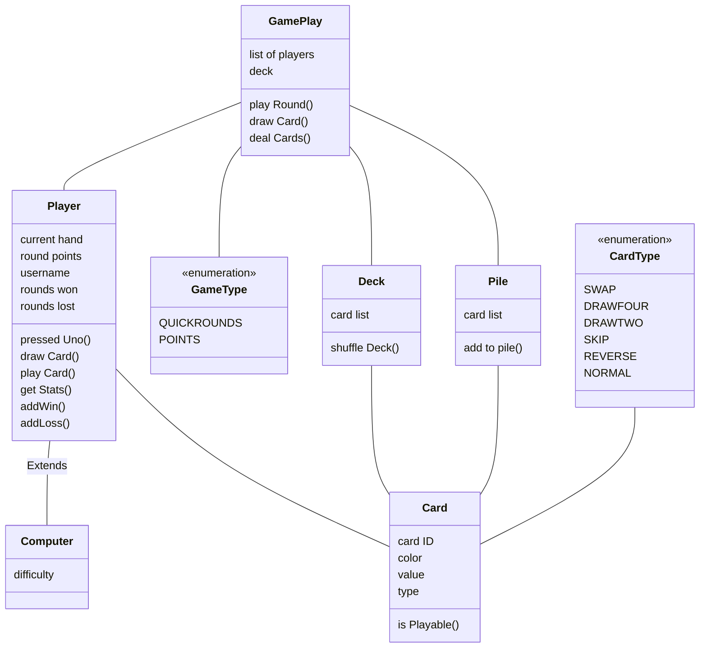
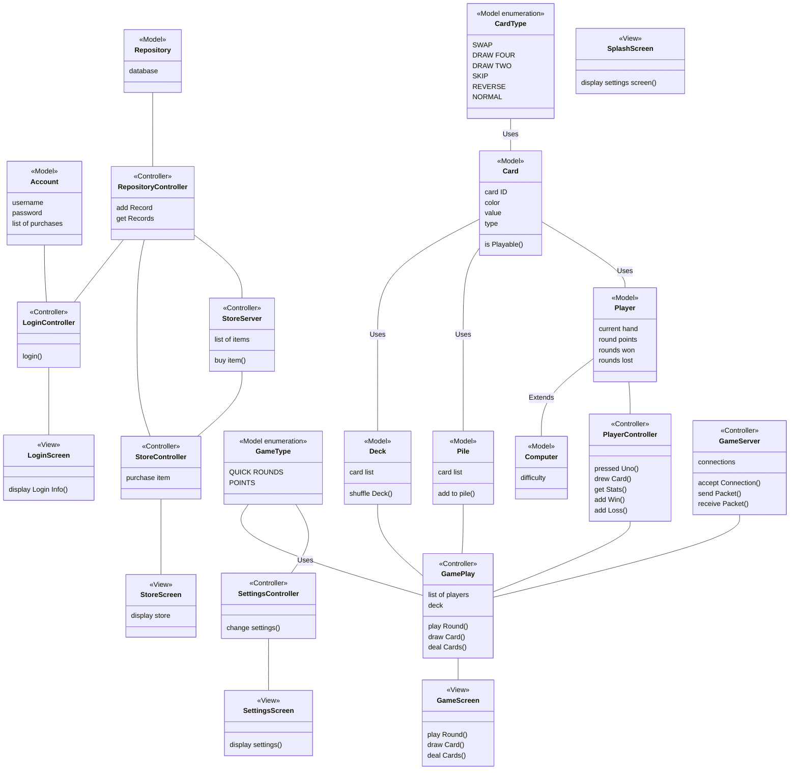

# Uno game Analysis Class Diagram

```mermaid
classDiagram

    class Player{

        current hand

        round points

        username

        rounds won

        rounds lost

        pressed Uno()

        draw Card()

        play Card()

        get Stats()

        addWin()

        addLoss()

    }

    class Computer{

        difficulty

    }

    class GamePlay {

        list of players

        deck

        play Round()

        draw Card()

        deal Cards()

    }

    class GameType {

        <<enumeration>>

        QUICKROUNDS

        POINTS

    }

    class Card {

        card ID

        color

        value

        type

        is Playable()

    }

    class Pile {

        card list

        add to pile()

    }

    class Deck {

        card list

        shuffle Deck()

    }

    class CardType {

        <<enumeration>>

        SWAP

        DRAWFOUR

        DRAWTWO

        SKIP

        REVERSE

        NORMAL

    }

Player -- Computer: Extends

Player -- Card

GamePlay -- GameType

GamePlay -- Player

GamePlay -- Deck

GamePlay -- Pile

Deck -- Card

Pile -- Card

CardType -- Card
```
# MVC Version

```mermaid
classDiagram

    class Player{

        <<Model>>

        current hand

        round points

        rounds won

        rounds lost

    }

    class PlayerController {

        <<Controller>>

        pressed Uno()

        drew Card()

        get Stats()

        add Win()

        add Loss()

    }

    class Computer{

        <<Model>>

        difficulty

    }

    class GamePlay {

        <<Controller>>

        list of players

        deck

        play Round()

        draw Card()

        deal Cards()

    }

    class Repository {

        <<Model>>

        database

    }

    class Account {

        <<Model>>

        username

        password

        list of purchases

    }

    class RepositoryController {

        <<Controller>>

        add Record

        get Records

    }

    class GameType {

        <<Model enumeration>>

        QUICK ROUNDS

        POINTS

    }

    class Card {

        <<Model>>

        card ID

        color

        value

        type

        is Playable()

    }

    class Pile {

        <<Model>>

        card list

        add to pile()

    }

    class Deck {

        <<Model>>

        card list

        shuffle Deck()

    }

    class CardType {

        <<Model enumeration>>

        SWAP

        DRAW FOUR

        DRAW TWO

        SKIP

        REVERSE

        NORMAL

    }

    class StoreController {

        <<Controller>>

        purchase item

    }

    class StoreScreen {

        <<View>>

        display store

    }

    class LoginController {

        <<Controller>>

        login()

    }

    class GameScreen {

        <<View>>

        play Round()

        draw Card()

        deal Cards()

    }

    class LoginScreen {

        <<View>>

        display Login Info()

    }

    class SplashScreen {

        <<View>>

        display settings screen()

    }

    class SettingsScreen {

        <<View>>

        display settings()

    }

    class SettingsController {

        <<Controller>>

        change settings()

    }

    class StoreServer {

        <<Controller>>

        list of items

        buy item()

    }

    class GameServer {

        <<Controller>>

        connections

        accept Connection()

        send Packet()

        receive Packet()

    }

    Player -- Computer: Extends

    GameType -- GamePlay: Uses

    CardType -- Card: Uses

    Card -- Deck: Uses

    Card -- Pile: Uses

    Card -- Player: Uses

    Account -- LoginController

    Pile -- GamePlay

    Deck -- GamePlay

  

    GameServer -- GamePlay

    Player -- PlayerController

    Repository -- RepositoryController

    GameType -- SettingsController

    StoreServer -- StoreController

    RepositoryController -- LoginController

    PlayerController -- GamePlay

    RepositoryController -- StoreController

    RepositoryController -- StoreServer

  

    SettingsController -- SettingsScreen

    LoginController -- LoginScreen

    GamePlay -- GameScreen

    StoreController -- StoreScreen
```
