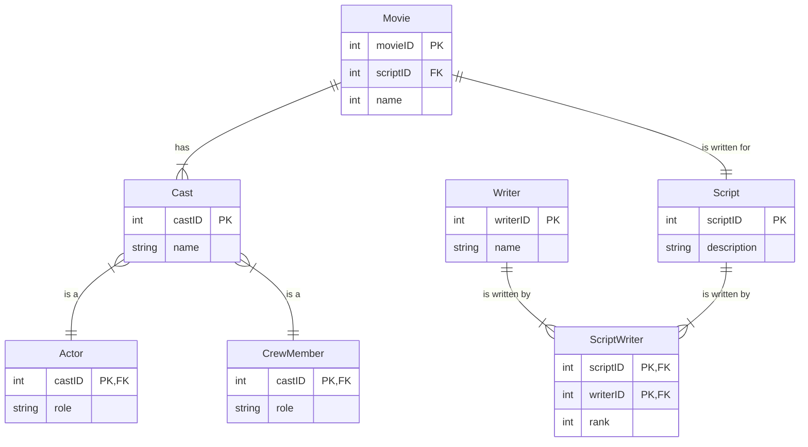

# ERD Review
*Entity* - Anything that can have an independent existence that be uniquely identified. An abstraction of the complexities found in some real world situation.
Cardinality/Modality are indicators of business rules around a relationship
*Cardinality* - How many instances of one entity relate to another
*Modality/Ordinality* - Describes the relationship as either optional or mandatory (Minimum number of related instances, either 0 or 1)

Cardinality is always on the outside, Modality on the inside
*Zero or more*

*One or more*

*One and only One*

*Zero or One*

### Relationship examples
#### One to One
Implies that there is exactly one row in the student entity for every row in the chair entity

Or, Chair is used by one and only one student

#### One to Many
One to many implies that there can be many courses taught by each instructor
Course is taught by one and only one instructor

A person is born in one and only one location
A birth location has 0 or many people born in it.

#### Many to Many
implies an instructor can teach many courses and a single course can be taught by man instructors

