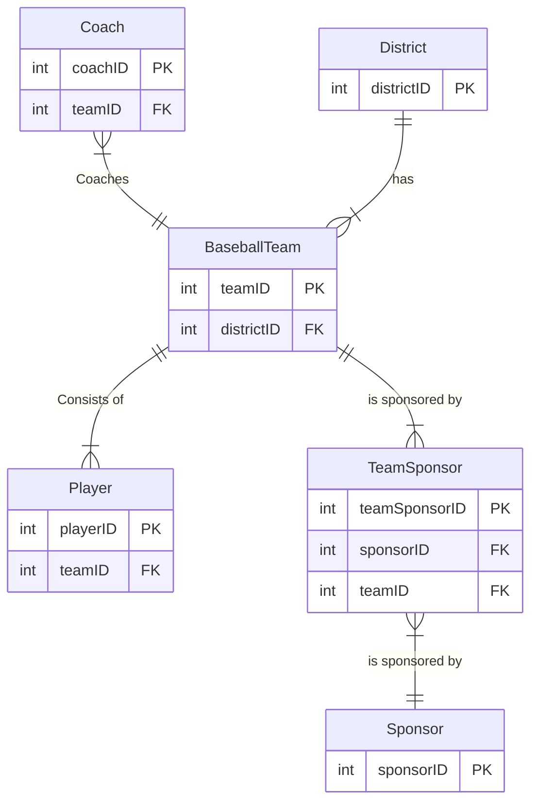
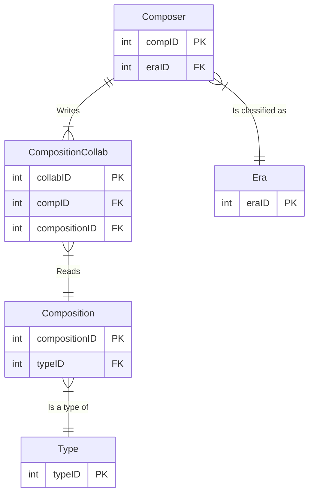
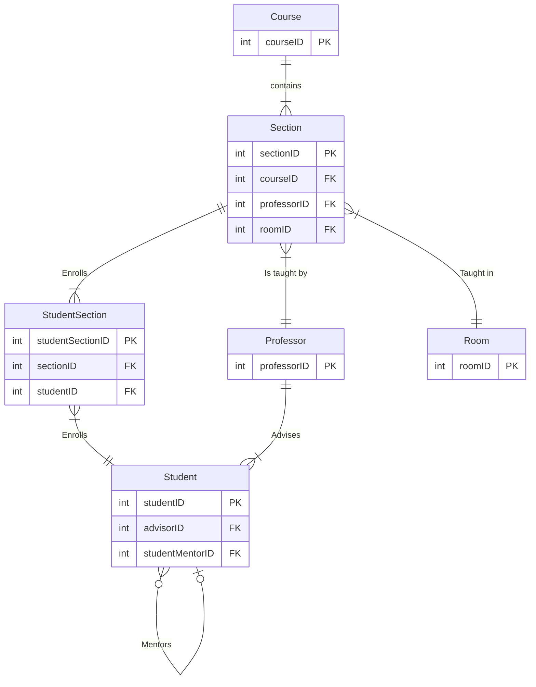

>Date: 2024 09 10 & 2024 09 12
>Author: Denali

# Example 1
Draw an Entity Relationship Diagram using Crow’s Foot notation based on the following business rules.  Show the entities and the relationships between the entities.  Do not show any attributes.

1. A ==baseball team== *has* up to 12 ==players==.  Each player can *play* for only one team.
2. Each team has at least one ==sponsor==.  Each sponsor may *sponsor* more than one team.
3. Each team has at least 3 ==coaches==.  Each coach can *coach* only one team.
4. A team *belongs to* 1 ==district==.  A district can have many teams.

## Entity-Relationship matrix

|   |   |   |   |   |   |
|---|---|---|---|---|---|
||team|player|sponsor|coach|district|
|team||x|x|x|x|
|player|x|||||
|sponsor|x|||||
|coach|x|||||
|district|x|||||

## Diagram

# Example 2
## Instructions
Draw an Entity Relationship Diagram using Crow’s Foot notation based on the following business rules.  Show the entities and the relationships between the entities.  Do not show any attributes.
1.      A ==composer== *writes/creates* many ==compositions==.
2.      The composer includes the name, country, year of birth, year of death and era (e.g. classical, baroque, romantic, or modern).
3.      The composition includes a title, type of composition (symphony, concerto, instrumental, chamber, opera, or choral)

# Example 3
Draw an Entity Relationship Diagram using Crow’s Foot notation based on the following business rules.  Show the entities and the relationships between the entities.  Do not show any attributes.

1. A ==course== *contains* many ==sections==, but each section references only one course. (A section is like an offering for a course, i.e. CDBM280 2019A and CDBM280 2019B)
2. A section is *taught* by one *professor*, but each professor may teach one or more different sections of one or more courses.
3. A section may *contain* many ==students==, and each student is enrolled in many sections.
4. Each section is *taught* in one ==room==, but each room may be used to teach different sections of one or more courses.
5. A professor *advises* many students, but a student has only one advisor.
6. A student may *mentor* other students, and a student can only have one mentor.

## Entity-Relationship Diagram

|           | Course | Section | Professor | Student | Room | Advisor | Mentor |
| --------- | ------ | ------- | --------- | ------- | ---- | ------- | ------ |
| Course    |        | x       | ??        |         | ??   |         |        |
| Section   | x      |         | x         | x       | x    |         |        |
| Professor | ??     | x       |           | x       |      |         |        |
| Student   |        | x       | x         | x       |      | ??      | ??     |
| Room      | ??     | x       |           |         |      |         |        |
| Advisor   |        |         |           | ??      |      |         |        |
| Mentor    |        |         |           | ??      |      |         |        |

## Diagram

*Self join on student table*
