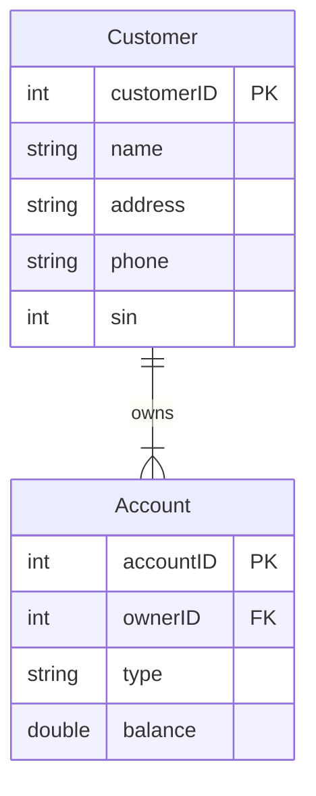
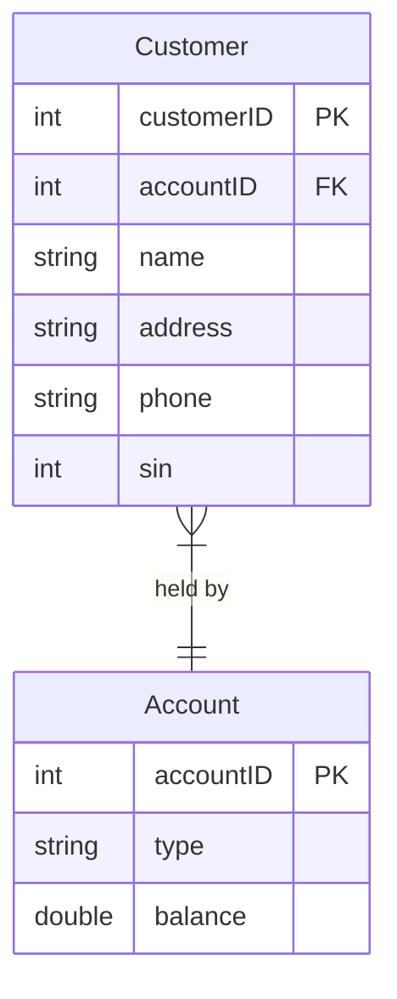
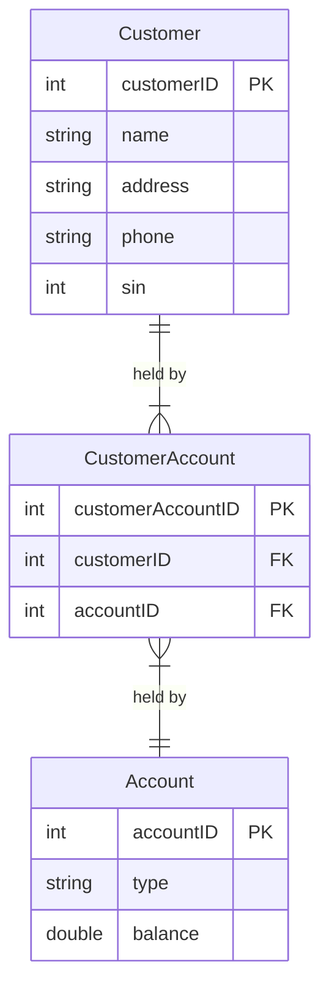
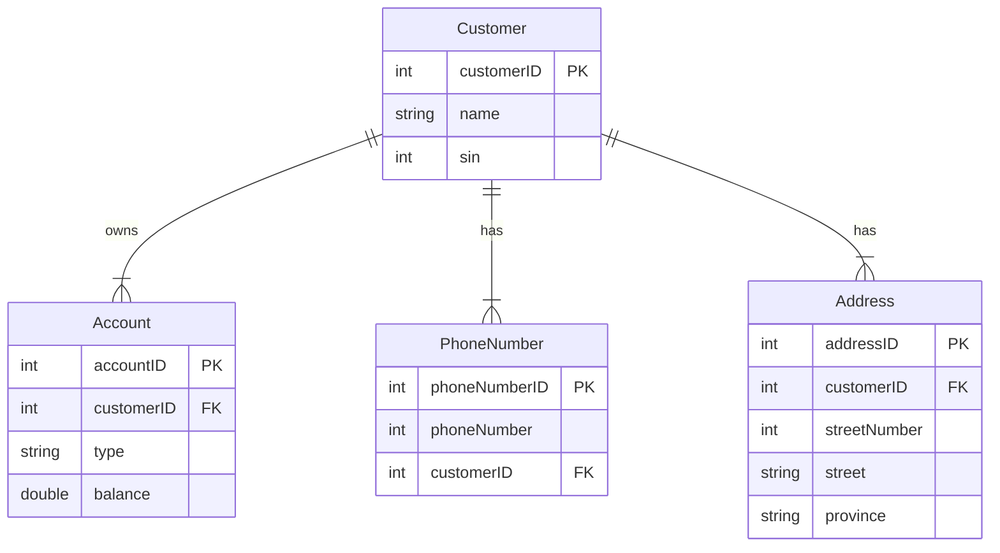
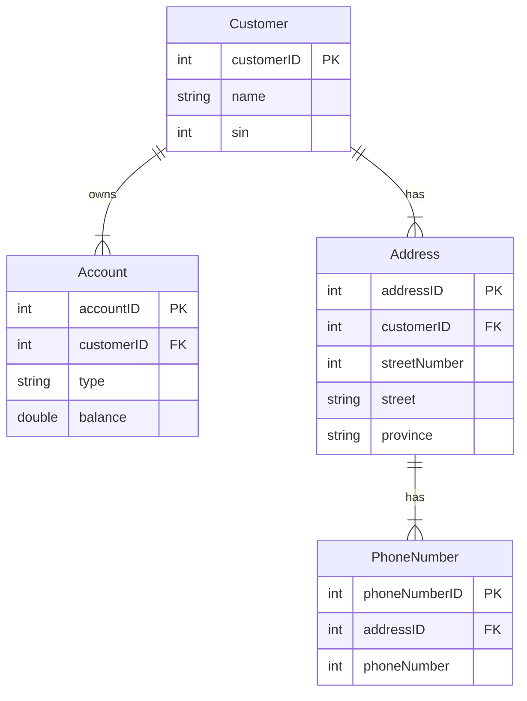
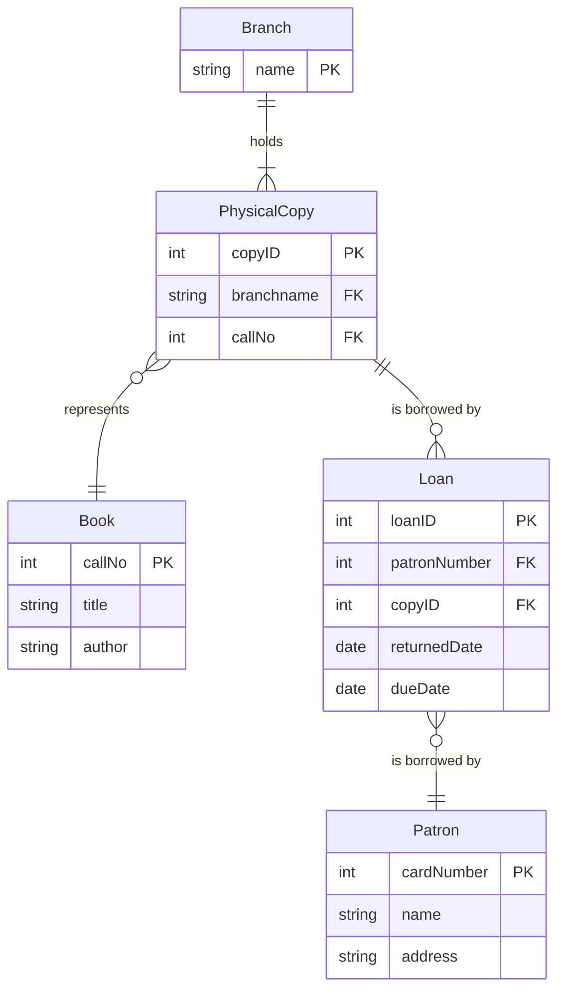

# Bank Example
Design a database for a bank, including information about ==customers== and their ==accounts==.  Information about customers includes their name, address, phone, and SIN.  Information about accounts includes the number, type (chequing, savings, etc.), and balance.  We need to track which customers *have* which accounts. 

Create a simple ERD for each of these separate possibilities:
1. An account can belong to only one customer but a customer can have many accounts
2. A customer can have only one account but the account can be jointly held by several customers
3. A customer can have many accounts and the account can be jointly held by several customers
4. A customer can have a set of addresses and a set of phone numbers
5. A customer can have a set of addresses and each address can have a set of phone numbers

## Diagram V1

## Diagram V2

## Diagram V3

*`CustomerAccount`* is a **weak entity**

## Diagram V4

## Diagram V5

# Library Example
The city public library has many ==branch== libraries, each identified by a unique name.  The system has a single catalog of ==books== shared by each branch library.  Each catalogue entry describes basic information about some book – e.g. a unique call number, title, and author.  In many instances, the library has many catalog copies of the same book located in different branch libraries and the circulation status of each copy is maintained.  ==Patrons== of the library acquire a unique ID card, with their name and address recorded.  Each loan of any particular copy of a book is recorded with the due date and a return date.  A patron may borrow a book more than once.

## Entity Relationship Matrix

|              | Branch | Catalog/book | PhysicalCopy | Patron |
| ------------ | ------ | ------------ | ------------ | ------ |
| Branch       |        | ??           | x            |        |
| Catalog/book | ??     |              | x            |        |
| PhysicalCopy | x      | x            |              | ??     |
| Patron       |        |              | ??           |        |

## Diagram

