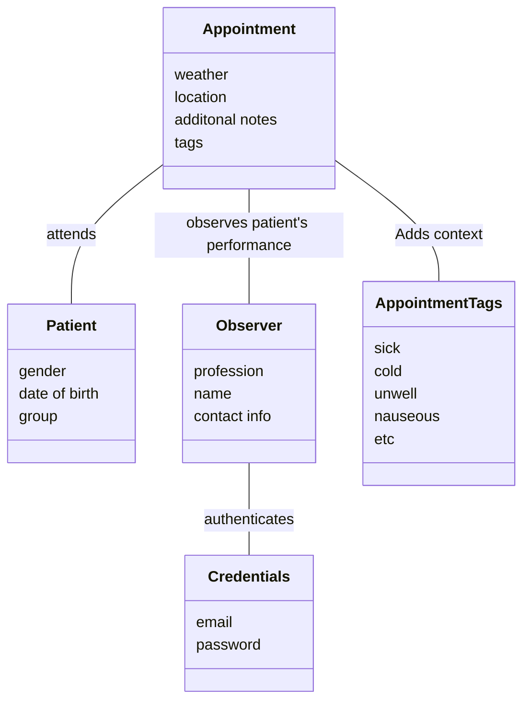
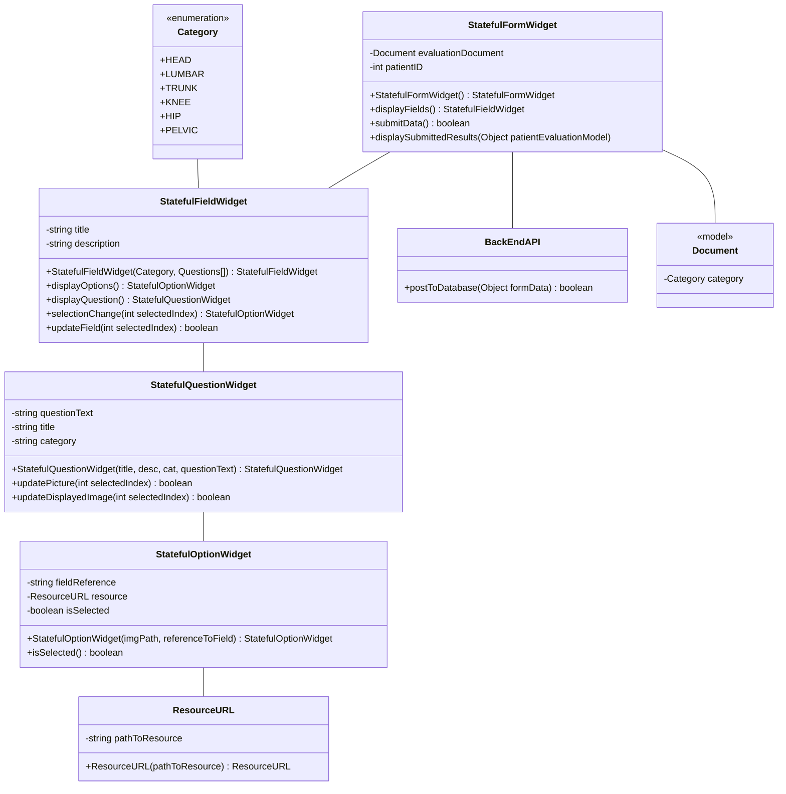
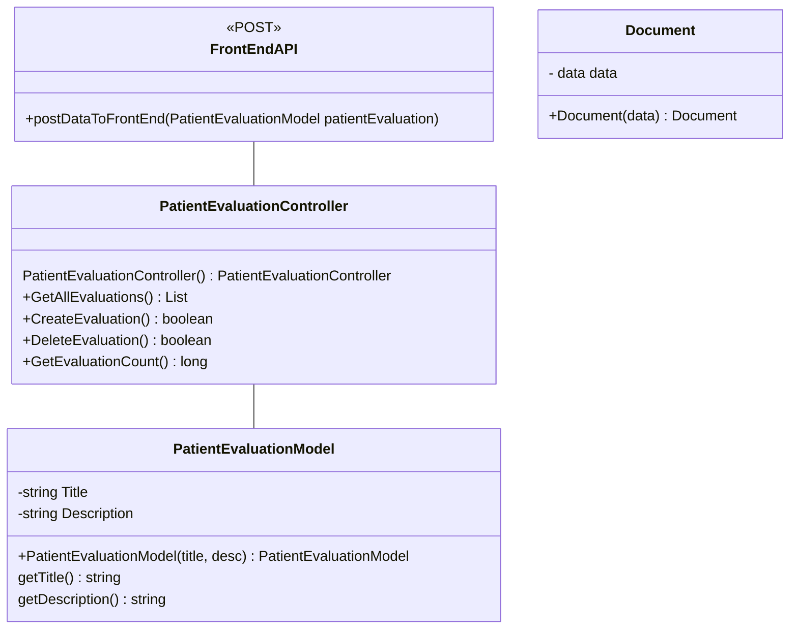
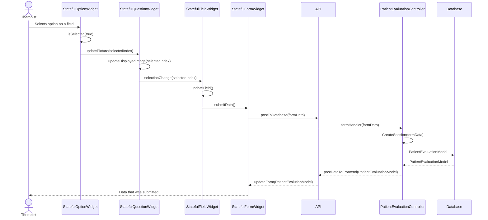

# Analysis

```mermaid
classDiagram

    Appointment -- Patient : attends

    Appointment -- Observer : observes patient's performance

    Observer -- Credentials : authenticates

    Appointment -- AppointmentTags : Adds context

  

    class Patient {

        gender

        date of birth

        group

    }

  

    class Observer {

        profession

        name

        contact info

    }

  

    class Appointment {

        weather

        location

        additonal notes

        tags

    }

  

    class Credentials {

        email

        password

    }

  

    class AppointmentTags {

        sick

        cold

        unwell

        nauseous

        etc

    }
```

# Release 1
## Implementation Class Diagram (Frontend)

```mermaid
classDiagram 
    StatefulFormWidget -- StatefulFieldWidget 
    Category -- StatefulFieldWidget 
    StatefulFieldWidget -- StatefulQuestionWidget 
    StatefulQuestionWidget -- StatefulOptionWidget 
    StatefulOptionWidget -- ResourceURL 
    StatefulFormWidget -- BackEndAPI 
    StatefulFormWidget -- Document 

    class StatefulFormWidget { 
        -Document evaluationDocument 
        -int patientID 
        +StatefulFormWidget() StatefulFormWidget 
        +displayFields() StatefulFieldWidget 
        +submitData() boolean 
        +displaySubmittedResults(Object patientEvaluationModel) 
    } 

    class StatefulFieldWidget { 
        -string title 
        -string description 
        +StatefulFieldWidget(Category, Questions[]) StatefulFieldWidget 
        +displayOptions() StatefulOptionWidget 
        +displayQuestion() StatefulQuestionWidget 
        +selectionChange(int selectedIndex) StatefulOptionWidget 
        +updateField(int selectedIndex) boolean 
    } 

    class StatefulQuestionWidget { 
        -string questionText 
        -string title 
        -string category 
        +StatefulQuestionWidget(title, desc, cat, questionText) StatefulQuestionWidget 
        +updatePicture(int selectedIndex) boolean 
        +updateDisplayedImage(int selectedIndex) boolean 
    } 

    class StatefulOptionWidget { 
        -string fieldReference 
        -ResourceURL resource 
        -boolean isSelected 
        +StatefulOptionWidget(imgPath, referenceToField) StatefulOptionWidget 
        +isSelected() boolean 
    } 

    class ResourceURL { 
        -string pathToResource 
        +ResourceURL(pathToResource) ResourceURL 
    } 

    class Category { 
        <<enumeration>> 
        +HEAD 
        +LUMBAR 
        +TRUNK 
        +KNEE 
        +HIP 
        +PELVIC 
    } 

    class Document { 
        <<model>> 
        -Category category 
    } 

    class BackEndAPI { 
        +postToDatabase(Object formData) boolean 
    } 
```

## Implementation Class Diagram (Backend)

```mermaid
classDiagram  
    FrontEndAPI -- PatientEvaluationController  
    PatientEvaluationController -- PatientEvaluationModel  

    class PatientEvaluationController {  
        PatientEvaluationController() PatientEvaluationController  
        +GetAllEvaluations() List<PatientEvaluationModel> 
        +CreateEvaluation() boolean 
        +DeleteEvaluation() boolean 
        +GetEvaluationCount() long 
    }  

    class PatientEvaluationModel {  
        -string Title  
        -string Description  
        +PatientEvaluationModel(title, desc) PatientEvaluationModel  
        getTitle() string  
        getDescription() string  
    }  

    class Document {  
        - data data  
        +Document(data) Document  
    }  

    class FrontEndAPI {  
        <<POST>>  
        +postDataToFrontEnd(PatientEvaluationModel patientEvaluation)  
    } 
```

## Sequence

```mermaid
sequenceDiagram
    Actor T as Therapist
    Participant Op as StatefulOptionWidget
    Participant Question as StatefulQuestionWidget
    Participant Field as StatefulFieldWidget
    Participant Form as StatefulFormWidget
    Participant API as API
    Participant controller as PatientEvaluationController
    Participant database as Database

    T ->> Op: Selects option on a field
    Op ->> Op: isSelected(true)
    Op ->> Question: updatePicture(selectedIndex)
    Question ->> Question: updateDisplayedImage(selectedIndex)
    Question ->> Field: selectionChange(selectedIndex)
    Field ->> Field: updateField()
    Field ->> Form: submitData()
    Form ->> API: postToDatabase(formData)
    API ->> controller: formHandler(formData)
    controller ->> controller: CreateSession(formData)
    controller ->> database: PatientEvaluationModel
    database -->> controller: PatientEvaluationModel
    controller -->> API: postDataToFrontend(PatientEvaluationModel)
    API -->> Form: updateForm(PatientEvalutionModel)
    Form -->> T: Data that was submitted
```
