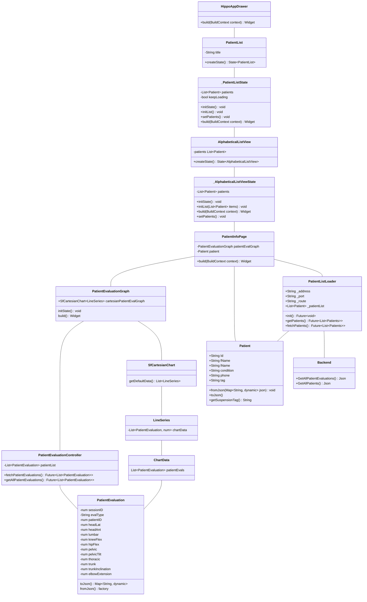
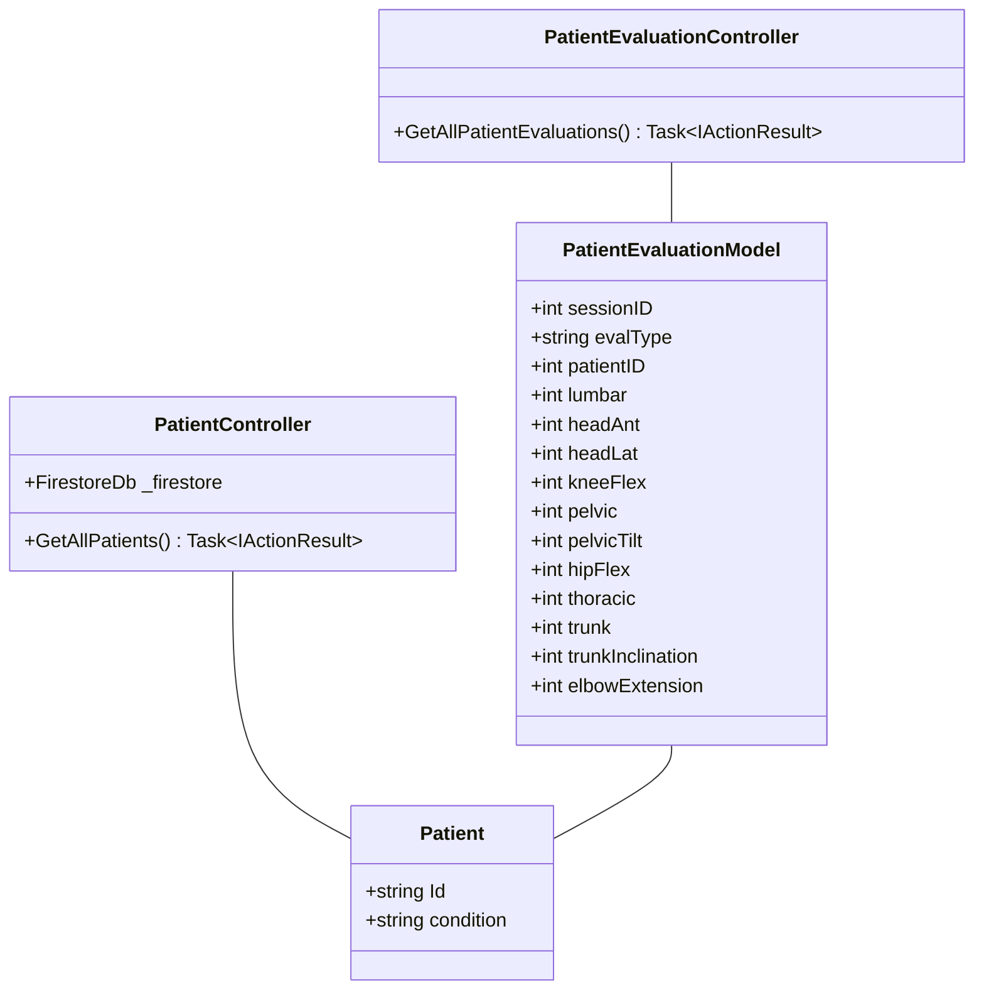
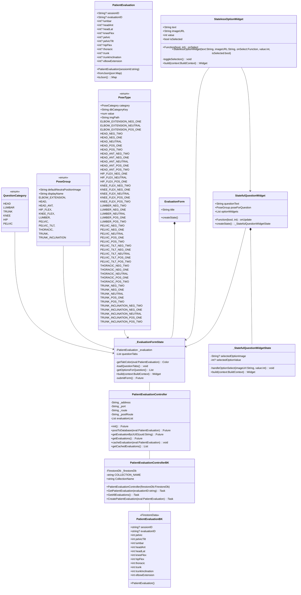

## Implementation
### Frontend

```mermaid
classDiagram
    SfCartesianChart -- LineSeries
    LineSeries -- ChartData
    ChartData -- PatientEvaluation
    PatientEvaluationController -- PatientEvaluation
    PatientEvaluationGraph -- PatientEvaluationController
    PatientEvaluationGraph -- SfCartesianChart
    PatientInfoPage -- PatientEvaluationGraph
    PatientInfoPage -- Patient
    PatientInfoPage -- PatientListLoader
    PatientListLoader -- Patient

    HippoAppDrawer -- PatientList
    PatientListLoader -- Backend


    AlphabeticalListView -- _AlphabeticalListViewState
    PatientList -- _PatientListState
    _PatientListState -- AlphabeticalListView
    _AlphabeticalListViewState -- PatientInfoPage

	class PatientList {
		-String title
        +createState() State~PatientList~
	}

    class HippoAppDrawer {
        +build(BuildContext context) Widget
    }

	class _PatientListState {
		-List~Patient~ patients
		-bool keepLoading
		+initState() void
		+initList() void
		+setPatients() void
		+build(BuildContext context) Widget
	}

	class PatientInfoPage {
		-PatientEvaluationGraph patientEvalGraph
		-Patient patient
		+build(BuildContext context) Widget
	}

    class PatientEvaluationGraph {
        +SfCartesianChart~LineSeries~ cartesianPatientEvalGraph
        initState() void
        build() Widget
    }

    class PatientEvaluationController {
        -List~PatientEvaluation~ patientList
        +fetchPatientEvaluations() Future~List~PatientEvaluation~~
        +getAllPatientEvaluations() Future~List~PatientEvaluation~~
    }

    class SfCartesianChart {
        getDefaultData() List~LineSeries~
    }

    class LineSeries {
        -List~PatientEvaluation, num~ chartData
    }

    class PatientEvaluation {
        -num sessionID
        -String evalType
        -num patientID
        -num headLat
        -num headAnt
        -num lumbar
        -num kneeFlex
        -num hipFlex
        -num pelvic
        -num pelvicTilt
        -num thoracic
        -num trunk
        -num trunkInclination
        -num elbowExtension
        toJson() Map~String, dynamic~
        fromJson() factory
    }

    class Patient {
        +String Id
        +String fName
        +String lName
        +String condition
        +String phone
        +String tag
        +fromJson(Map~String, dynamic~ json) void
        +toJson()
        +getSuspensionTag() String
    }

    class PatientListLoader {
        +String _address
        +String _port
        +String _route
        +List~Patient~ _patientList
        +init() Future~void~
        +getPatients() Future~List~Patients~~
        +fetchPatients() Future~List~Patients~~
    }

    class ChartData {
        List~PatientEvaluation~ patientEvals
    }

    class AlphabeticalListView {
        -patients List~Patient~
        +createState() State~AlphabeticalListView~
    }

    class _AlphabeticalListViewState {
        -List~Patient~ patients
        +initState() void
        +initList(List~Patient~ items) void
        +build(BuildContext context) Widget
        +setPatients() void
    }

    class Backend {
        +GetAllPatientEvaluations() Json
        +GetAllPatients() Json
    }
```

### Backend

```mermaid
classDiagram
	PatientEvaluationController -- PatientEvaluationModel
	PatientController -- Patient
	PatientEvaluationModel -- Patient

	class PatientEvaluationModel {
        +int sessionID
        +string evalType
        +int patientID
        +int lumbar
        +int headAnt
        +int headLat
        +int kneeFlex
        +int pelvic
        +int pelvicTilt
        +int hipFlex
        +int thoracic
        +int trunk
        +int trunkInclination
        +int elbowExtension
    }

	class Patient {
		+string Id
		+string condition
	}

    class PatientEvaluationController {
        +GetAllPatientEvaluations() Task~IActionResult~
    }

	class PatientController {
		+FirestoreDb _firestore
		+GetAllPatients() Task~IActionResult~
	}
```

### Noah's Diagram

```mermaid
classDiagram
class PatientEvaluation{
+String? sessionID
+String? evaluationID
+int? lumbar
+int? headAnt
+int? headLat
+int? kneeFlex
+int? pelvic
+int? pelvicTilt
+int? hipFlex
+int? thoracic
+int? trunk
+int? trunkInclination
+int? elbowExtension
+PatientEvaluation(sessionId:string)
+fromJson(json:Map)
+toJson()::Map
}
class PatientEvaluationController{
-String _address
-String _port
-String _route
-String _postRoute
-List<PatientEvaluation> evaluationList
+init():Future<void>
+postToDatabase(eval:PatientEvaluation):Future<void>
+getEvaluationByUUID(uuid:String):Future<PatientEvaluation>
+getEvaluations():Future<List>
+cacheEvaluation(eval:PatientEvaluation):void
+getCachedEvaluations():List<PatientEvaluation>
}
class QuestionCategory{
<<enum>>
HEAD
LUMBAR
TRUNK
KNEE
HIP
PELVIC
}
%% PoseCategory Enum
class PoseGroup{
<<enum>>
+String defaultNeutraPositionImage
+String displayName
ELBOW_EXTENSION,
HEAD,
HEAD_ANT,
HIP_FLEX,
KNEE_FLEX,
LUMBER,
PELVIC,
PELVIC_TILT,
THORACIC,
TRUNK,
TRUNK_INCLINATION
}
class PoseType{
<<enum>>
+PoseCategory category
+String dbCategoryKey
+num value
+String imgPath
%% Elbow Extension
ELBOW_EXTENSION_NEG_ONE
ELBOW_EXTENSION_NEUTRAL
ELBOW_EXTENSION_POS_ONE
%% Head
HEAD_NEG_TWO
HEAD_NEG_ONE
HEAD_NEUTRAL
HEAD_POS_ONE
HEAD_POS_TWO
%% Head Ant
HEAD_ANT_NEG_TWO
HEAD_ANT_NEG_ONE
HEAD_ANT_NEUTRAL
HEAD_ANT_POS_ONE
HEAD_ANT_POS_TWO
%% Hip Flex
HIP_FLEX_NEG_ONE
HIP_FLEX_NEUTRAL
HIP_FLEX_POS_ONE
%% Knee Flex
KNEE_FLEX_NEG_TWO
KNEE_FLEX_NEG_ONE
KNEE_FLEX_NEUTRAL
KNEE_FLEX_POS_ONE
KNEE_FLEX_POS_TWO
%% Lumber
LUMBER_NEG_TWO
LUMBER_NEG_ONE
LUMBER_NEUTRAL
LUMBER_POS_ONE
LUMBER_POS_TWO
%% Pelvic
PELVIC_NEG_TWO
PELVIC_NEG_ONE
PELVIC_NEUTRAL
PELVIC_POS_ONE
PELVIC_POS_TWO
%% Pelvic Tilt
PELVIC_TILT_NEG_TWO
PELVIC_TILT_NEG_ONE
PELVIC_TILT_NEUTRAL
PELVIC_TILT_POS_ONE
PELVIC_TILT_POS_TWO
%% Thoracic
THORACIC_NEG_TWO
THORACIC_NEG_ONE
THORACIC_NEUTRAL
THORACIC_POS_ONE
THORACIC_POS_TWO
%% Trunk
TRUNK_NEG_TWO
TRUNK_NEG_ONE
TRUNK_NEUTRAL
TRUNK_POS_ONE
TRUNK_POS_TWO
%% Trunk Inclination
TRUNK_INCLINATION_NEG_TWO
TRUNK_INCLINATION_NEG_ONE
TRUNK_INCLINATION_NEUTRAL
TRUNK_INCLINATION_POS_ONE
TRUNK_INCLINATION_POS_TWO
}
class EvaluationForm{
+String title
+createState()
}
class _EvaluationFormState{
-PatientEvaluation _evaluation
-List<TabData> questionTabs
-getTabColor(eval:PatientEvaluation):Color
-loadQuestionTabs():void
-getOptionsForQuestion():List<StatelessOptionWidget>
+build(context:BuildContext):Widget
-submitForm():Future<void>
}
class StatefulQuestionWidget{
+String questionText
+PoseGroup poseForQuestion
+List<StatelessOptionWidget> optionWidgets
+Function(bool, int) onUpdate
+createState():_StatefulQuestionWidgetState
}
class _StatefulQuestionWidgetState{
-String? selectedOptionImage
-int? selectedOptionValue
-handleOptionSelect(imageUrl:String, value:int):void
+build(context:BuildContext):Widget
}
class StatelessOptionWidget{
+String text
+String imageURL
+Function(bool, int) onSelect
+int value
+bool isSelected
+StatelessOptionWidget(text:String, imageURL:String, onSelect:Function, value:int, isSelected:bool)
-toggleSelection():void
+build(context:BuildContext):Widget
}
%% backend classes
class PatientEvaluationBK{
<<FirestoreData>>
+string? sessionID
+string? evaluationID
+int pelvic
+int pelvicTilt
+int lumbar
+int headAnt
+int headLat
+int kneeFlex
+int hipFlex
+int thoracic
+int trunk
+int trunkInclination
+int elbowExtension
+PatientEvaluation()
}
class PatientEvaluationControllerBK{
-FirestoreDb _firestoreDb
-string COLLECTION_NAME
+string CollectionName
+PatientEvaluationController(firestoreDb:FirestoreDb)
+GetPatientEvaluation(evaluationID:string):Task<IActionResult>
+GetAllEvaluations():Task<IActionResult>
+CreatePatientEvaluation(eval:PatientEvaluation):Task<IActionResult>
}
EvaluationForm *-- _EvaluationFormState
StatefulQuestionWidget *-- _StatefulQuestionWidgetState
StatelessOptionWidget --> StatefulQuestionWidget
StatelessOptionWidget --> _EvaluationFormState
StatefulQuestionWidget --> _EvaluationFormState
PoseType --> _EvaluationFormState
PoseGroup --> _EvaluationFormState
QuestionCategory --> _EvaluationFormState
_EvaluationFormState -- PatientEvaluationController
PatientEvaluationController -- PatientEvaluationControllerBK
PatientEvaluationControllerBK -- PatientEvaluationBK
```
