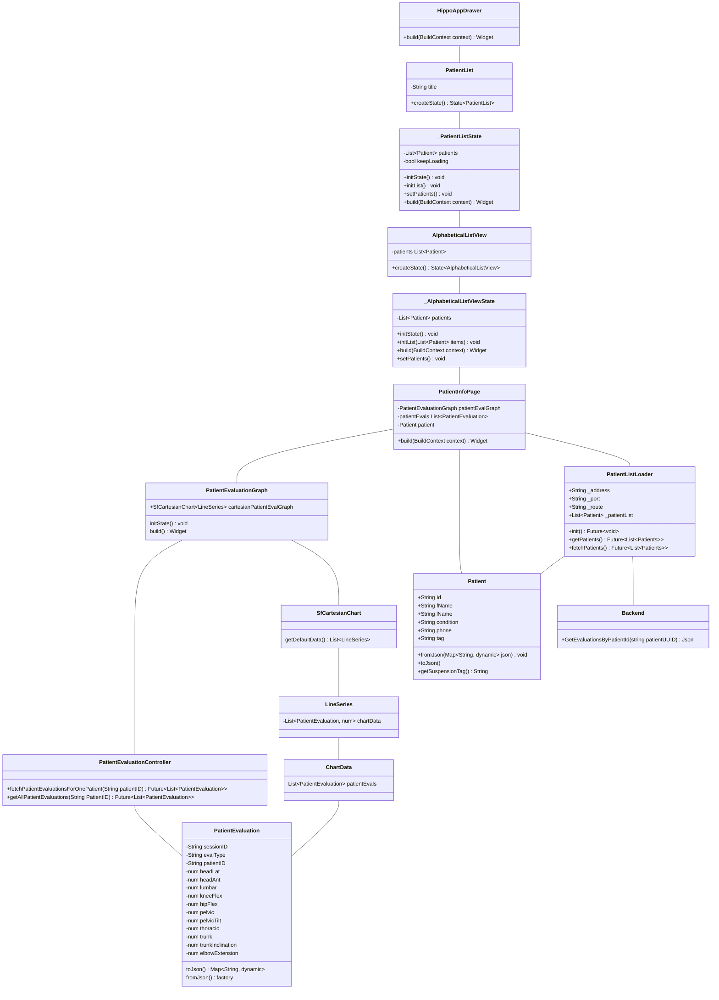
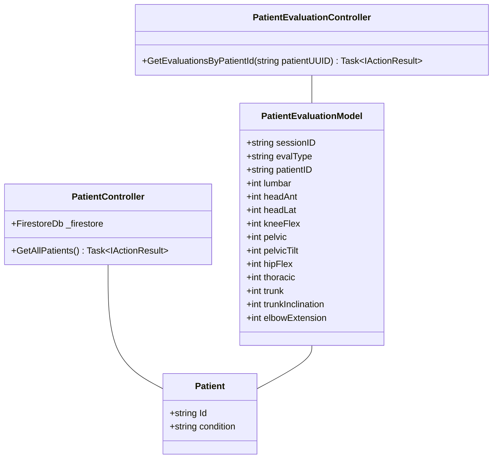

### Frontend

```mermaid
classDiagram
    SfCartesianChart -- LineSeries
    LineSeries -- ChartData
    ChartData -- PatientEvaluation
    PatientEvaluationController -- PatientEvaluation
    PatientEvaluationGraph -- PatientEvaluationController
    PatientEvaluationGraph -- SfCartesianChart
    PatientInfoPage -- PatientEvaluationGraph
    PatientInfoPage -- Patient
    PatientInfoPage -- PatientListLoader
    PatientListLoader -- Patient

    HippoAppDrawer -- PatientList
    PatientListLoader -- Backend


    AlphabeticalListView -- _AlphabeticalListViewState
    PatientList -- _PatientListState
    _PatientListState -- AlphabeticalListView
    _AlphabeticalListViewState -- PatientInfoPage

	class PatientList {
		-String title
        +createState() State~PatientList~
	}

    class HippoAppDrawer {
        +build(BuildContext context) Widget
    }

	class _PatientListState {
		-List~Patient~ patients
		-bool keepLoading
		+initState() void
		+initList() void
		+setPatients() void
		+build(BuildContext context) Widget
	}

	class PatientInfoPage {
		-PatientEvaluationGraph patientEvalGraph
		-patientEvals List~PatientEvaluation~
		-Patient patient
		+build(BuildContext context) Widget
	}

    class PatientEvaluationGraph {
        +SfCartesianChart~LineSeries~ cartesianPatientEvalGraph
        initState() void
        build() Widget
    }

    class PatientEvaluationController {
        +fetchPatientEvaluationsForOnePatient(String patientID) Future~List~PatientEvaluation~~
        +getAllPatientEvaluations(String PatientID) Future~List~PatientEvaluation~~
    }

    class SfCartesianChart {
        getDefaultData() List~LineSeries~
    }

    class LineSeries {
        -List~PatientEvaluation, num~ chartData
    }

    class PatientEvaluation {
        -String sessionID
        -String evalType
        -String patientID
        -num headLat
        -num headAnt
        -num lumbar
        -num kneeFlex
        -num hipFlex
        -num pelvic
        -num pelvicTilt
        -num thoracic
        -num trunk
        -num trunkInclination
        -num elbowExtension
        toJson() Map~String, dynamic~
        fromJson() factory
    }

    class Patient {
        +String Id
        +String fName
        +String lName
        +String condition
        +String phone
        +String tag
        +fromJson(Map~String, dynamic~ json) void
        +toJson()
        +getSuspensionTag() String
    }

    class PatientListLoader {
        +String _address
        +String _port
        +String _route
        +List~Patient~ _patientList
        +init() Future~void~
        +getPatients() Future~List~Patients~~
        +fetchPatients() Future~List~Patients~~
    }

    class ChartData {
        List~PatientEvaluation~ patientEvals
    }

    class AlphabeticalListView {
        -patients List~Patient~
        +createState() State~AlphabeticalListView~
    }

    class _AlphabeticalListViewState {
        -List~Patient~ patients
        +initState() void
        +initList(List~Patient~ items) void
        +build(BuildContext context) Widget
        +setPatients() void
    }

    class Backend {
        +GetEvaluationsByPatientId(string patientUUID) Json
    }
```

### Backend

```mermaid
classDiagram
	PatientEvaluationController -- PatientEvaluationModel
	PatientController -- Patient
	PatientEvaluationModel -- Patient

	class PatientEvaluationModel {
        +string sessionID
        +string evalType
        +string patientID
        +int lumbar
        +int headAnt
        +int headLat
        +int kneeFlex
        +int pelvic
        +int pelvicTilt
        +int hipFlex
        +int thoracic
        +int trunk
        +int trunkInclination
        +int elbowExtension
    }

	class Patient {
		+string Id
		+string condition
	}

    class PatientEvaluationController {
        +GetEvaluationsByPatientId(string patientUUID) Task~IActionResult~
    }

	class PatientController {
		+FirestoreDb _firestore
		+GetAllPatients() Task~IActionResult~
	}
```
