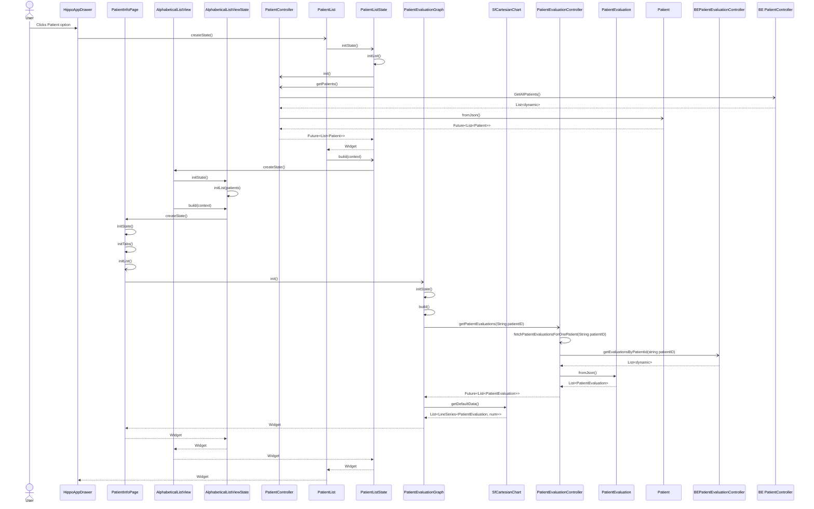

```mermaid
sequenceDiagram
	Actor U AS User
	Participant HAD AS HippoAppDrawer
	Participant PIP AS PatientInfoPage
	Participant ALV AS AlphabeticalListView
	Participant ALVs AS AlphabeticalListViewState
	Participant PC AS PatientController
	Participant PL AS PatientList
	Participant PLs AS PatientListState
	Participant PEG AS PatientEvaluationGraph
	Participant SFCC AS SfCartesianChart
	Participant PEC AS PatientEvaluationController
	Participant PE AS PatientEvaluation
	Participant P AS Patient
	
	Participant BEPEC AS BEPatientEvaluationController
	Participant BEPC AS BE PatientController

	U->>HAD: Clicks Patient option
	HAD-)PL: createState()
	PL-)PLs: initState()
	PLs->>PLs: initList()
	PLs-)PC: init()
	PLs-)PC: getPatients()
	PC-)BEPC: GetAllPatients()
	BEPC-->>PC: List<dynamic>
	PC-)P: fromJson()
	P-->>PC: Future<List<Patient>>
	PC-->>PLs: Future<List<Patient>>
	PLs-->>PL: Widget
	PL-)PLs: build(context)

	PLs->>ALV: createState()
	ALV->>ALVs: initState()
	ALVs->>ALVs: initList(patients)
	ALV->>ALVs: build(context)
	ALVs->>PIP: createState()
	PIP->>PIP: initState()
	PIP->>PIP: initTabs()
	PIP-)PIP: initList()
	PIP-)PEG: init()
	PEG->>PEG: initState()
	PEG->>PEG: build()

	PEG-)PEC: getPatientEvaluations(String patientID)
	PEC-)PEC: fetchPatientEvaluationsForOnePatient(String patientID)
	PEC-)BEPEC: getEvaluationsByPatientId(string patientID)
	BEPEC-->>PEC: List<dynamic>
	PEC->>PE: fromJson()
	PE-->>PEC: List<PatientEvaluation>
	PEC-->>PEG: Future<List<PatientEvaluation>>
	
	PEG->>SFCC: getDefaultData()
	SFCC-->>PEG: List<LineSeries<PatientEvaluation, num>>

	PEG-->>PIP: Widget
	PIP-->>ALVs: Widget
	ALVs-->>ALV: Widget
	ALV-->>PLs: Widget
	PLs-->>PL: Widget
	PL-->>HAD: Widget
```
