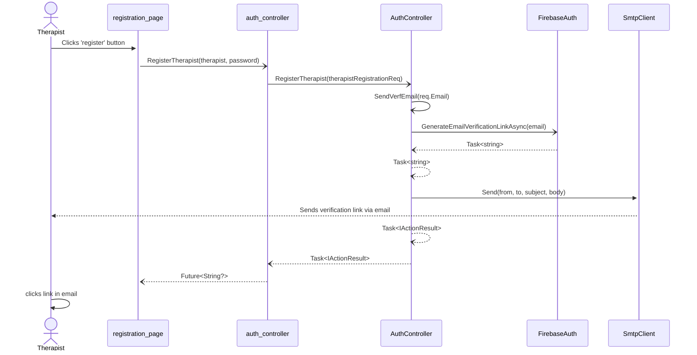

# Notes
### ATP
Might want to move the "Valid therapist registration data" to the top

### Class Diagrams
#### Backend
`authcontroller.cs` should have the following added (mermaid syntax)
- `+GetUserByEmail(string email) Task<IActionResult>` - also in this method you should have `[FromRoute] string email` in the method header, and for the route do `[HttpGet("users/{email}")]` instead of `[HttpGet("users/{uid}"]`

#### Frontend
- No changes

### Sequence

