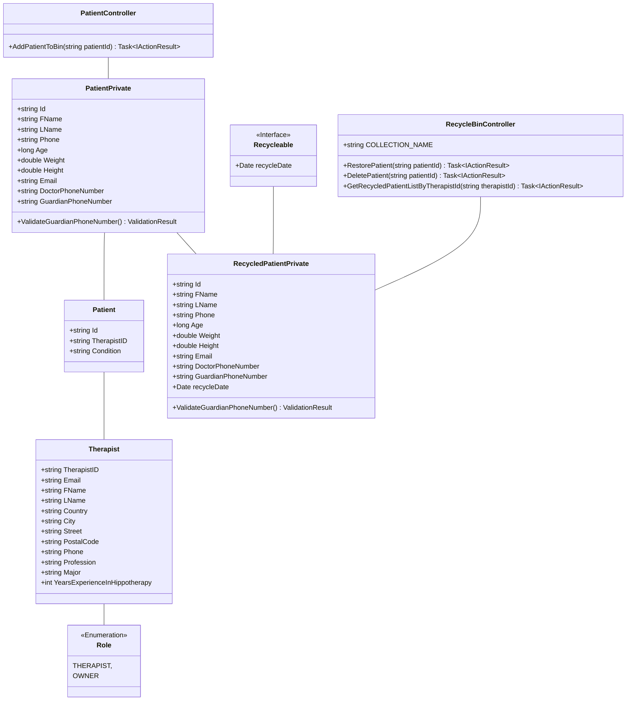

```mermaid
classDiagram
	PatientPrivate -- Patient
	Patient -- Therapist
	Therapist -- Role
	PatientPrivate -- RecycledPatientPrivate
	Recycleable -- RecycledPatientPrivate
	RecycleBinController -- RecycledPatientPrivate
	PatientController -- PatientPrivate

	class Role {
	<<Enumeration>>
		THERAPIST,
		OWNER
	}

	class Recycleable {
		<<Interface>>
		+Date recycleDate
	}

	class Therapist {
		+string TherapistID
		+string Email
		+string FName
		+string LName
		+string Country
		+string City
		+string Street
		+string PostalCode
		+string Phone
		+string Profession
		+string Major
		+int YearsExperienceInHippotherapy
	}

	class Patient {
		+string Id
		+string TherapistID
		+string Condition
	}

	class PatientPrivate {
		+string Id
		+string FName
		+string LName
		+string Phone
		+long Age
		+double Weight
		+double Height
		+string Email
		+string DoctorPhoneNumber
		+string GuardianPhoneNumber
		+ValidateGuardianPhoneNumber() ValidationResult
	}

	class RecycledPatientPrivate {
		+string Id
		+string FName
		+string LName
		+string Phone
		+long Age
		+double Weight
		+double Height
		+string Email
		+string DoctorPhoneNumber
		+string GuardianPhoneNumber
		+ValidateGuardianPhoneNumber() ValidationResult
		+Date recycleDate
	}

	class PatientController {
		+AddPatientToBin(string patientId) Task~IActionResult~
	}

	class RecycleBinController {
		+string COLLECTION_NAME
		+RestorePatient(string patientId) Task~IActionResult~
		+DeletePatient(string patientId) Task~IActionResult~
		+GetRecycledPatientListByTherapistId(string therapistId) Task~IActionResult~
	}
```