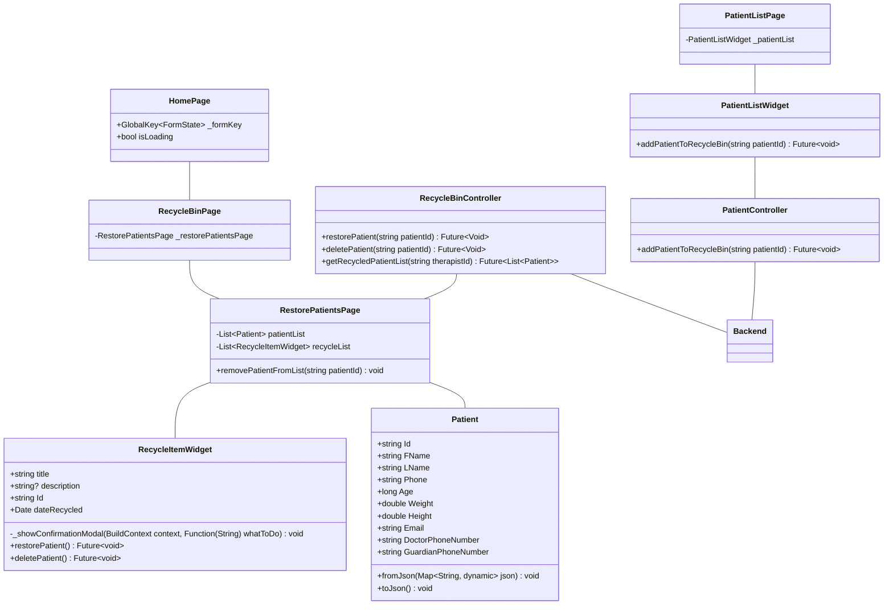

```mermaid
classDiagram
	HomePage -- RecycleBinPage
	RecycleBinPage -- RestorePatientsPage
	RecycleBinController -- RestorePatientsPage
	RestorePatientsPage -- RecycleItemWidget
	RestorePatientsPage -- Patient
	PatientListPage -- PatientListWidget
	PatientListWidget -- PatientController
	PatientController -- Backend
	RecycleBinController -- Backend

	class Patient {
		+string Id
		+string FName
		+string LName
		+string Phone
		+long Age
		+double Weight
		+double Height
		+string Email
		+string DoctorPhoneNumber
		+string GuardianPhoneNumber
		+fromJson(Map~String, dynamic~ json) void
		+toJson() void
	}

	class PatientController {
		+addPatientToRecycleBin(string patientId) Future~void~
	}

	class RecycleBinPage {
		-RestorePatientsPage _restorePatientsPage
	}

	class RestorePatientsPage {
		-List~Patient~ patientList
		-List~RecycleItemWidget~ recycleList
		+removePatientFromList(string patientId) void
	}

	class RecycleBinController {
		+restorePatient(string patientId) Future~Void~
		+deletePatient(string patientId) Future~Void~
		+getRecycledPatientList(string therapistId) Future~List~Patient~~
	}

	class RecycleItemWidget {
		+string title
		+string? description
		+string Id
		+Date dateRecycled
		-_showConfirmationModal(BuildContext context, Function(String) whatToDo) void
		+restorePatient() Future~void~
		+deletePatient() Future~void~
	}

	class HomePage {
		+GlobalKey~FormState~ _formKey
		+bool isLoading
	}

	class PatientListPage {
		-PatientListWidget _patientList
	}

	class PatientListWidget {
		+addPatientToRecycleBin(string patientId) Future~void~
	}
```