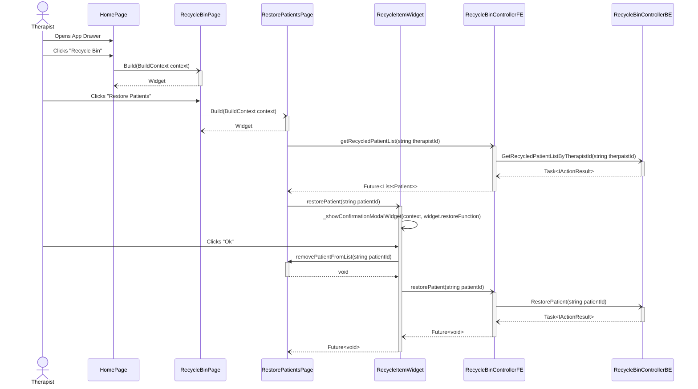

```mermaid
sequenceDiagram
	Actor T as Therapist
	Participant HP as HomePage
	Participant RBP as RecycleBinPage
	Participant RPP as RestorePatientsPage
	Participant RIW as RecycleItemWidget
	Participant RBC as RecycleBinControllerFE

	Participant RBCBE as RecycleBinControllerBE

	T ->> HP: Opens App Drawer
	T ->> HP: Clicks "Recycle Bin"
	HP -) RBP: Build(BuildContext context)
	activate RBP
	RBP --) HP: Widget
	deactivate RBP
	T ->> RBP: Clicks "Restore Patients"
	RBP -) RPP: Build(BuildContext context)
	activate RPP
	RPP --) RBP: Widget
	deactivate RPP
	RPP -) RBC: getRecycledPatientList(string therapistId)
	activate RBC
	RBC -) RBCBE: GetRecycledPatientListByTherapistId(string therpaistId)
	activate RBCBE
	RBCBE --) RBC: Task<IActionResult>
	deactivate RBCBE
	RBC --) RPP: Future<List<Patient>>
	deactivate RBC
	RPP -) RIW: restorePatient(string patientId)
	activate RIW
	RIW -) RIW: _showConfirmationModalWidget(context, widget.restoreFunction)
	T ->> RIW: Clicks "Ok"
	RIW ->> RPP: removePatientFromList(string patientId)
	activate RPP
	RPP -->> RIW: void
	deactivate RPP
	RIW -) RBC: restorePatient(string patientId)
	activate RBC
	RBC -) RBCBE: RestorePatient(string patientId)
	activate RBCBE
	RBCBE --) RBC: Task<IActionResult>
	deactivate RBCBE
	RBC --) RIW: Future<void>
	deactivate RBC
	RIW --) RPP: Future<void>
	deactivate RIW
```