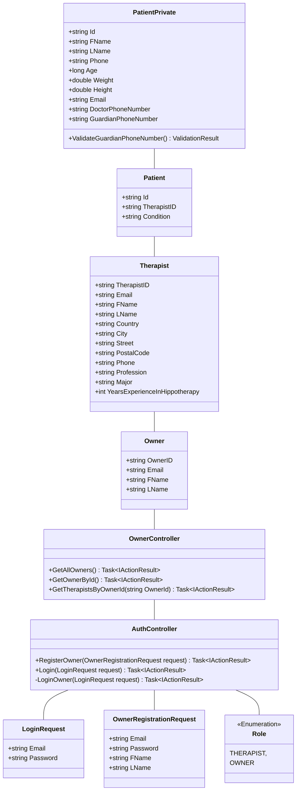

```mermaid
classDiagram
	PatientPrivate -- Patient
	Patient -- Therapist
	Therapist -- Owner
	Owner -- OwnerController
	OwnerController -- AuthController
	AuthController -- LoginRequest
	AuthController -- OwnerRegistrationRequest
	AuthController -- Role

	class Owner {
		+string OwnerID
		+string Email
		+string FName
		+string LName
	}

	class Role {
	<<Enumeration>>
		THERAPIST,
		OWNER
	}

	class Therapist {
		+string TherapistID
		+string Email
		+string FName
		+string LName
		+string Country
		+string City
		+string Street
		+string PostalCode
		+string Phone
		+string Profession
		+string Major
		+int YearsExperienceInHippotherapy
	}

	class Patient {
		+string Id
		+string TherapistID
		+string Condition
	}

	class PatientPrivate {
		+string Id
		+string FName
		+string LName
		+string Phone
		+long Age
		+double Weight
		+double Height
		+string Email
		+string DoctorPhoneNumber
		+string GuardianPhoneNumber
		+ValidateGuardianPhoneNumber() ValidationResult
	}

	class OwnerController {
		+GetAllOwners() Task~IActionResult~
		+GetOwnerById() Task~IActionResult~
		+GetTherapistsByOwnerId(string OwnerId) Task~IActionResult~
	}

	class LoginRequest {
		+string Email
		+string Password
	}

	class OwnerRegistrationRequest {
		+string Email
		+string Password
		+string FName
		+string LName
	}

	class AuthController {
		+RegisterOwner(OwnerRegistrationRequest request) Task~IActionResult~
		+Login(LoginRequest request) Task~IActionResult~
		-LoginOwner(LoginRequest request) Task~IActionResult~
	}
```