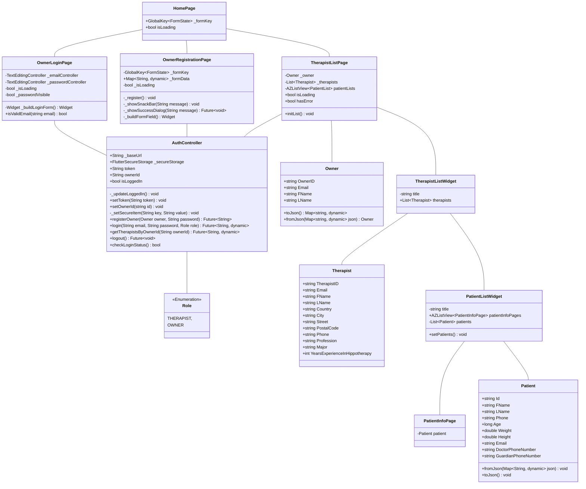

```mermaid
classDiagram
	HomePage -- OwnerLoginPage
	HomePage -- OwnerRegistrationPage
	OwnerLoginPage -- AuthController
	OwnerRegistrationPage -- AuthController
	AuthController -- Role

	HomePage -- TherapistListPage
	TherapistListPage -- Owner
	TherapistListWidget -- Therapist

	TherapistListPage -- TherapistListWidget
	TherapistListPage -- AuthController
	TherapistListWidget -- PatientListWidget
	PatientListWidget -- PatientInfoPage
	PatientListWidget -- Patient

	class Owner {
		+string OwnerID
		+string Email
		+string FName
		+string LName
		+toJson() Map~string, dynamic~
		+fromJson(Map~string, dynamic~ json) Owner
	}

	class Role {
		<<Enumeration>>
		THERAPIST,
		OWNER
	}

	class Therapist {
		+string TherapistID
		+string Email
		+string FName
		+string LName
		+string Country
		+string City
		+string Street
		+string PostalCode
		+string Phone
		+string Profession
		+string Major
		+int YearsExperienceInHippotherapy
	}

	class Patient {
		+string Id
		+string FName
		+string LName
		+string Phone
		+long Age
		+double Weight
		+double Height
		+string Email
		+string DoctorPhoneNumber
		+string GuardianPhoneNumber
		+fromJson(Map~String, dynamic~ json) void
		+toJson() void
	}

	class OwnerRegistrationPage {
		-GlobalKey~FormState~ _formKey
		+Map~String, dynamic~ _formData
		-bool _isLoading
		-_register() void
		-_showSnackBar(String message) void
		-_showSuccessDialog(String message) Future~void~
		-_buildFormField() Widget
	}

	class OwnerLoginPage {
		-TextEditingController _emailController
		-TextEditingController _passwordController
		-bool _isLoading
		-bool _passwordVisibile
		-Widget _buildLoginForm() Widget
		+isValidEmail(string email) bool
	}

	class TherapistListPage {
		-Owner _owner
		-List~Therapist~ _therapists
		-AZListView~PatientList~ patientLists
		+bool isLoading
		+bool hasError
		+initList() void
	}

	class HomePage {
		+GlobalKey~FormState~ _formKey
		+bool isLoading
	}

	class AuthController {
		+String _baseUrl
		+FlutterSecureStorage _secureStorage
		+String token
		+String ownerId
		+bool isLoggedIn
		-_updateLoggedIn() void
		+setToken(String token) void
		+setOwnerId(string id) void
		-_setSecureItem(String key, String value) void
		+registerOwner(Owner owner, String password) Future~String~
		+login(String email, String password, Role role) Future~String, dynamic~
		+getTherapistsByOwnerId(String ownerId) Future~String, dynamic~
		+logout() Future~void~
		+checkLoginStatus() bool
	}

	class PatientListWidget {
		-string title
		+AZListView~PatientInfoPage~ patientInfoPages
		-List~Patient~ patients
		+setPatients() void
	}

	class TherapistListWidget {
		-string title
		+List~Therapist~ therapists
		
	}

	class PatientInfoPage {
		-Patient patient
	}
```