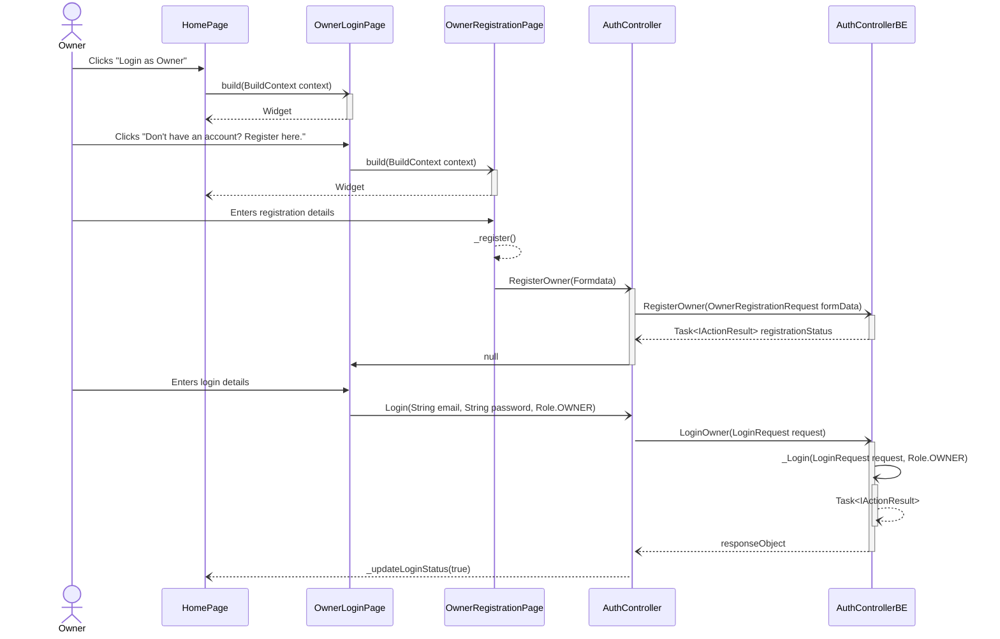

```mermaid
sequenceDiagram
	Actor Owner
	participant HP as HomePage
	participant OLP as OwnerLoginPage
	participant ORP as OwnerRegistrationPage
	participant OAC as AuthController
	participant AC as AuthControllerBE

	Owner ->> HP: Clicks "Login as Owner"
	HP -) OLP: build(BuildContext context)
	activate OLP
	OLP --) HP: Widget
	deactivate OLP
	Owner ->> OLP: Clicks "Don't have an account? Register here."
	OLP -) ORP: build(BuildContext context)
	activate ORP
	ORP --) HP: Widget
	deactivate ORP
	Owner ->> ORP: Enters registration details
	ORP -->> ORP: _register()
	ORP -) OAC: RegisterOwner(Formdata)
	activate OAC
	OAC -) AC: RegisterOwner(OwnerRegistrationRequest formData)
	activate AC
	AC --) OAC: Task<IActionResult> registrationStatus
	deactivate AC
	OAC ->> OLP: null
	deactivate OAC
	Owner ->> OLP: Enters login details
	OLP -) OAC: Login(String email, String password, Role.OWNER)
	activate OAC
	OAC -) AC: LoginOwner(LoginRequest request)
	activate AC
	AC -) AC: _Login(LoginRequest request, Role.OWNER)
	activate AC
	AC --) AC: Task<IActionResult>
	deactivate AC
	AC --) OAC: responseObject
	deactivate AC
	OAC --) HP: _updateLoginStatus(true)
```