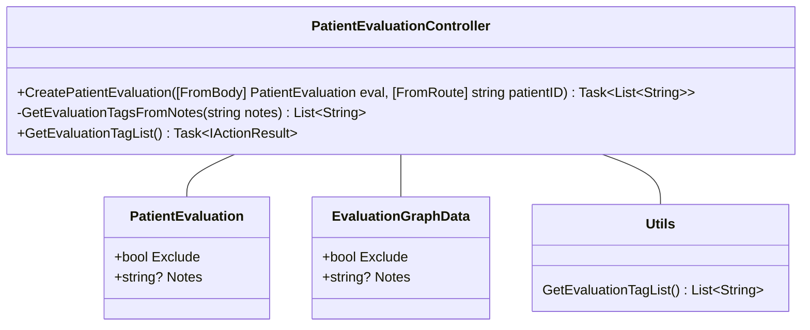

```mermaid
classDiagram
	PatientEvaluationController -- PatientEvaluation
	PatientEvaluationController -- EvaluationGraphData
	PatientEvaluationController -- Utils

	class PatientEvaluationController {
		+CreatePatientEvaluation([FromBody] PatientEvaluation eval, [FromRoute] string patientID) Task~List~String~~
		-GetEvaluationTagsFromNotes(string notes) List~String~
		+GetEvaluationTagList() Task~IActionResult~
	}

	class PatientEvaluation {
		+bool Exclude
		+string? Notes
	}

	class Utils {
		GetEvaluationTagList() List~String~
	}

	class EvaluationGraphData {
		+bool Exclude
		+string? Notes
	}
```