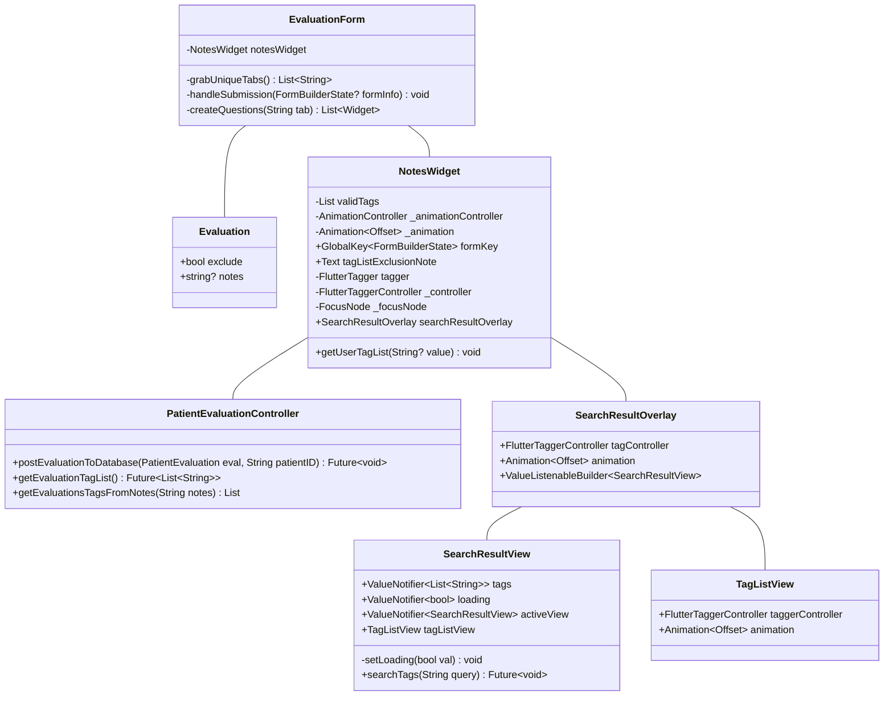

```mermaid
classDiagram
	EvaluationForm -- Evaluation
	EvaluationForm -- NotesWidget
	NotesWidget -- PatientEvaluationController
	NotesWidget -- SearchResultOverlay
	SearchResultOverlay -- SearchResultView
	SearchResultOverlay -- TagListView

	class Evaluation {
		+bool exclude
		+string? notes
	}

	class PatientEvaluationController {
		+postEvaluationToDatabase(PatientEvaluation eval, String patientID) Future~void~
		+getEvaluationTagList() Future~List~String~~
		+getEvaluationsTagsFromNotes(String notes) List<String>
	}

	class EvaluationForm {
		-NotesWidget notesWidget
		-grabUniqueTabs() List~String~
		-handleSubmission(FormBuilderState? formInfo) void
		-createQuestions(String tab) List~Widget~
	}

	class NotesWidget {
		-List<String> validTags
		-AnimationController _animationController
		-Animation~Offset~ _animation
		+GlobalKey~FormBuilderState~ formKey
		+Text tagListExclusionNote
		-FlutterTagger tagger
		-FlutterTaggerController _controller
		-FocusNode _focusNode
		+getUserTagList(String? value) void
		+SearchResultOverlay searchResultOverlay
	}

	class SearchResultOverlay {
		+FlutterTaggerController tagController
		+Animation~Offset~ animation
		+ValueListenableBuilder~SearchResultView~
	}

	class SearchResultView {
		+ValueNotifier~List~String~~ tags
		+ValueNotifier~bool~ loading
		+ValueNotifier~SearchResultView~ activeView
		-setLoading(bool val) void
		+searchTags(String query) Future~void~
		+TagListView tagListView
	}

	class TagListView {
		+FlutterTaggerController taggerController
		+Animation~Offset~ animation
	}
```