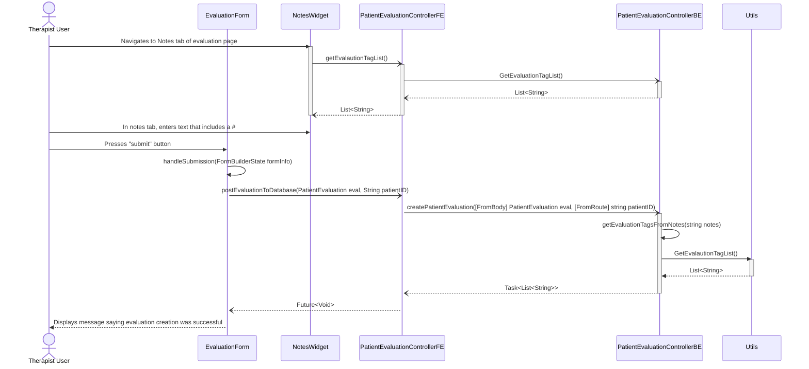

```mermaid
sequenceDiagram
	Actor TH as Therapist User
	Participant EF as EvaluationForm
	Participant NW as NotesWidget
	Participant PECFE as PatientEvaluationControllerFE
	Participant PECBE as PatientEvaluationControllerBE
	Participant Utils as Utils

	TH ->> NW: Navigates to Notes tab of evaluation page

	# Get tag list from backend
	activate NW
	NW -) PECFE: getEvalautionTagList()
	activate PECFE
	PECFE -) PECBE: GetEvaluationTagList()
	activate PECBE
	PECBE --) PECFE: List<String>
	deactivate PECBE
	PECFE --) NW: List<String>
	deactivate PECFE
	deactivate NW

	TH ->> NW: In notes tab, enters text that includes a #35;
	TH ->> EF: Presses "submit" button

	EF ->> EF: handleSubmission(FormBuilderState formInfo)
	activate EF
	EF -) PECFE: postEvaluationToDatabase(PatientEvaluation eval, String patientID)
	activate PECFE
	PECFE -) PECBE: createPatientEvaluation([FromBody] PatientEvaluation eval, [FromRoute] string patientID)
	activate PECBE
	PECBE ->> PECBE: getEvaluationTagsFromNotes(string notes)
	PECBE ->> Utils: GetEvalautionTagList()
	activate Utils
	Utils -->> PECBE: List<String>
	deactivate Utils
	PECBE --) PECFE: Task<List<String>>
	deactivate PECBE
	PECFE --) EF: Future<Void>
	EF -->> TH: Displays message saying evaluation creation was successful
```
