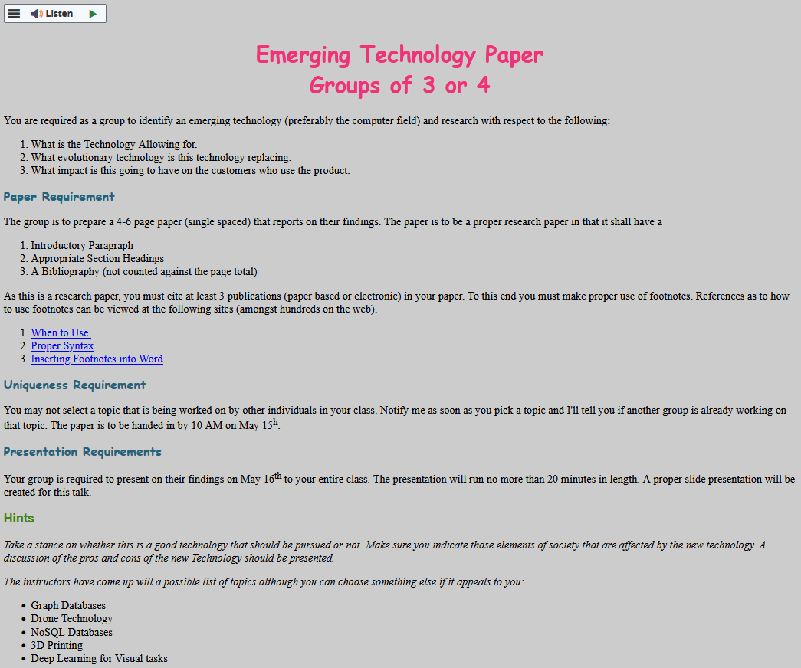

# Ideas
- **3D printing**
- Bendable displays
- VR
- **Steam**
- Polyfunctional robots (mech suits), haptic suits
- Digital Twins
- **Upscaling and Framegen in games**

## Steam
- Proton Compatibility (Gaming on linux)

### What it Allows for
- No longer bound to one platform because of Proton

### What it replaces
- Current Game stores and operating system

### Impact on Customers
- More freedom to use the operating system you want
- Puts control into the hands of customers
- Provides a large platform that you can rely on to publish games as a developer and purchase games as a player

## 3D Printing

### What it allows for
- Cheap build costs
- DIY, community driven
- Creation of components that would previously be non-feasible
- Ability to use materials that can't be otherwise utilized (Like flesh)
- Right to repair

### What it replaces
- CNC
- Molds
- Assembly lines
- The need to buy parts from large companies

### Impact on Customers
- Puts the control in the hands of customers
- Save money because you don't have buy parts from the original merchant
- Fast prototyping and low production costs for DIY projects

## Upscaling and Framegen in Games
### What it allows for
- Saves people money from buying new hardware (not really, talk about it later)
- Saves developers time since they don't have to optimize their game as much (not really a good thing)
- Increases framerate (motion fluidity) in exchange for increased latency and inaccuracy/hallucinations

### What it Replaces
- Innovative hardware upgrades by video card manufacturers
- Development time spent optimizing the game

### Impact on Customers
- Depends on the customer

#### Cons
- Increased latency
- hallucinations
- Loss of detail in the image
- Hardcore/competitive players especially don't like it for these reasons
- Trend of developers not optimizing their game well because 'everyone will just use upscaling anyways' (quality standard in the industry has dropped)
- Trend of hardware engineers not innovating with new technology (Especially Nvidia, although don't care about gaming anymore, focused almost solely on AI)
- Works best on the newest generation hardware (which sucks because old PCs are what need the technology the most to get most modern AAA games to a playable state)

#### Pros
- Increased motion fluidity
- Makes more games playable on mid-range PCs (although this wouldn't be an issue without it because then developers would have to optimize more)