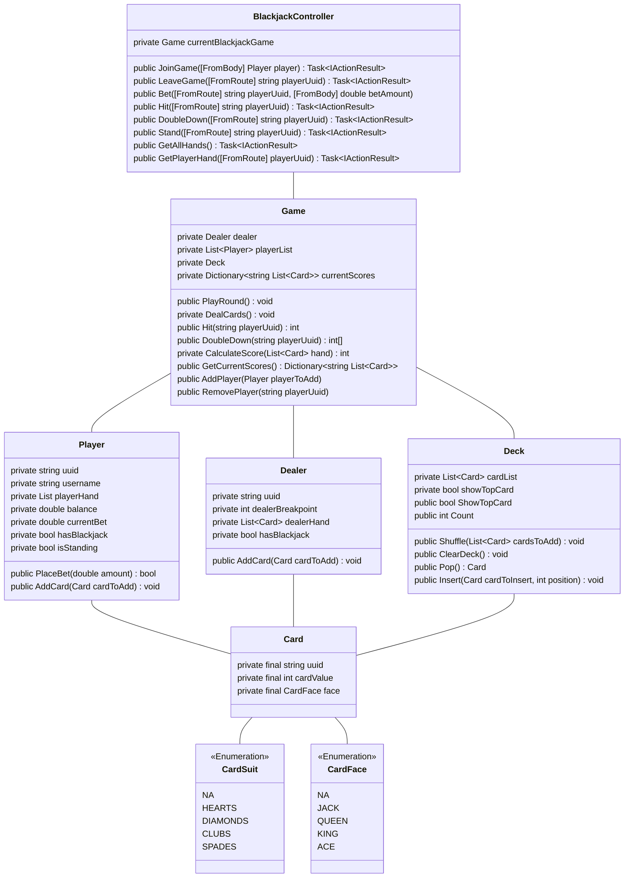

```mermaid
classDiagram
	%% Blackjack specific classes
	Game -- Player
	Game -- Dealer
	Game -- Deck
	Player -- Card
	Dealer -- Card
	Deck -- Card
	Card -- CardSuit
	Card -- CardFace

	class Player {
		%% Later on we will probably want to add a token or something in here
		%% So that we can properly authenticate the player.
		%% For now, we will just use their uuid
		private string uuid
		private string username
		private List<Card> playerHand
		private double balance
		private double currentBet
		private bool hasBlackjack
		private bool isStanding
		public PlaceBet(double amount) bool
		public AddCard(Card cardToAdd) void
	}

	class Card {
		private final string uuid
		%% Not sure what I'm going to do for aces yet, but -1 will specify that the card is facedown
		%% (in which case the face and suit would also be NA)
		private final int cardValue
		private final CardFace face
	}

	class Dealer {
		private string uuid
		private int dealerBreakpoint
		private List~Card~ dealerHand
		private bool hasBlackjack
		public AddCard(Card cardToAdd) void
	}

	class Deck {
		private List~Card~ cardList
		private bool showTopCard
		public bool ShowTopCard
		public int Count
		public Shuffle(List~Card~ cardsToAdd) void
		public ClearDeck() void
		public Pop() Card
		%% Want to make it so that you can put it at the bottom, top or anywhere in between
		%% default picks a random position
		public Insert(Card cardToInsert, int position) void
	}

	class CardSuit {
		<<Enumeration>>
		%% Should only need NA if the card is facedown
		NA
		HEARTS
		DIAMONDS
		CLUBS
		SPADES
	}

	class CardFace {
		<<Enumeration>>
		NA
		JACK
		QUEEN
		KING
		ACE
	}

	class Game {
		private Dealer dealer
		private List~Player~ playerList
		private Deck 
		%% Will display the current scores of each player/dealer, maps
		%% usernames to a list of cards (each player's hand)
		%% This will not display the dealer's second card UNLESS the it's the dealer's turn
		private Dictionary~string List~Card~~ currentScores  

		public PlayRound() void
		private DealCards() void
		public Hit(string playerUuid) int
		%% Not sure exactly how I'm going to return the score for this
		public DoubleDown(string playerUuid) int[]
		private CalculateScore(List~Card~ hand) int
		
		%% Will have to copy the dealer's hand and set the values on their second card to NA
		public GetCurrentScores() Dictionary~string List~Card~~
		public AddPlayer(Player playerToAdd)
		public RemovePlayer(string playerUuid)
	}

	%% API specific classes
	BlackjackController -- Game

	class BlackjackController {
		%% This class will be located in the API project and is publicly accessible via the API
		
		private Game currentBlackjackGame
		public JoinGame([FromBody] Player player) Task~IActionResult~
		public LeaveGame([FromRoute] string playerUuid) Task~IActionResult~
		public Bet([FromRoute] string playerUuid, [FromBody] double betAmount)
		public Hit([FromRoute] string playerUuid) Task~IActionResult~
		public DoubleDown([FromRoute] string playerUuid) Task~IActionResult~
		public Stand([FromRoute] string playerUuid) Task~IActionResult~
		public GetAllHands() Task~IActionResult~
		public GetPlayerHand([FromRoute] playerUuid) Task~IActionResult~
	}
```